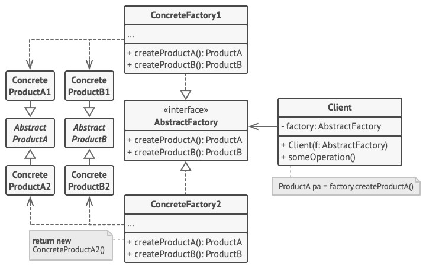

# Abstract Factory - Абстрактная фабрика
* Позволяет создавать семейства взаимосвязанных или родственных объектов без указания их конкретных типов.
* Клиент использует абстрактный интерфейс для создания логически связанных продуктов, не зная, какие конкретно продукты будут созданы.
* Абстрактная фабрика представляет собой иерархию создания семейства взаимосвязанных или родственных объектов.

### Аналогия из реального мира
Мебельный магазин производит:
1. Семейство зависимых продуктов: Кресло, Диван, Столик.
2. Вариации этого семейства: Ар-деко, Викторианский, Модерн.

Задачи:
1. Производить продукты так, чтобы они сочетались друг с другом, т.е. были в одном стиле.
2. Быть готовым к тому, что в будущем появятся новые продукты и новые вариации.

### Решаемые проблемы
* Управление различными вариациями зависимых объектов.
* Необходимость создавать объекты так, чтобы они сочетались друг с другом.
* При добавлении новых типов и семейств продуктов не должен переписываться или ломаться существующий код (реализуется OCP).

### Решение
* Выделить общие интерфейсы для отдельных продуктов, составляющих семейства.
* Создать абстрактную фабрику – общий интерфейс для создания всех продуктов семейства.
* Методы абстрактной фабрики возвращают абстрактные типы продуктов, представленные ранее выделенными интерфейсами.
* Для каждой вариации продукта создаётся своя собственная фабрика (реализация интерфейса).
* Клиенты работают с фабриками и продуктами через интерфейс.
* Конкретная фабрика может создаваться при запуске приложения или с помощью паттерна Одиночка.

### Диаграмма классов

1. `AbstractProduct`. Абстрактные продукты объявляют интерфейсы продуктов, которые связаны друг с другом по смыслу, но выполняют разные функции.
2. `ConcreteProduct`. Конкретные продукты — большой набор классов, которые относятся к различным абстрактным продуктам (кресло/столик), но имеют одни и те же вариации (Викторианский/Модерн).
3. `AbstractFactory`. Абстрактная фабрика объявляет методы создания различных абстрактных продуктов (кресло/столик).
4. `ConcreteFactory`. Конкретные фабрики относятся каждая к своей вариации продуктов (Викторианский/Модерн) и реализуют методы абстрактной фабрики, позволяя создавать все продукты определённой вариации.
5. Несмотря на то, что конкретные фабрики порождают конкретные продукты, сигнатуры их методов должны возвращать соответствующие абстрактные продукты.  
Это позволит клиентскому коду, использующему фабрику, не привязываться к конкретным классам продуктов.  
Клиент сможет работать с любыми вариациями продуктов через абстрактные интерфейсы.

### Недостатки
* Создаётся множество дополнительных классов.
* Требуется наличие всех типов продуктов каждой вариации.
* При появлении нового абстрактного фабричного метода его нужно будет добавить во все реализации фабрик.

### Примеры использования
1. `DbProviderFactory` (ADO.NET). Фабричные методы:
* `DbConnection? CreateConnection()`
* `DbCommand? CreateCommand()`
* `DbParameter? CreateParameter()`
* и др.
2. DI-контейнеры.

### Абстрактная фабрика VS Фабричный метод
| Абстрактная фабрика         | Фабричный метод         |
|-----------------------------|-------------------------|
| Создаёт семейство продуктов | Создаёт один продукт    |
| Использует композицию       | Использует наследование |
