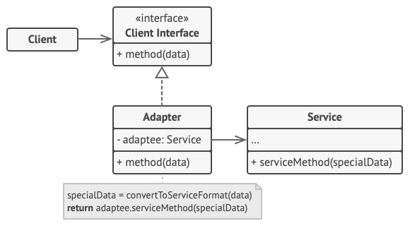
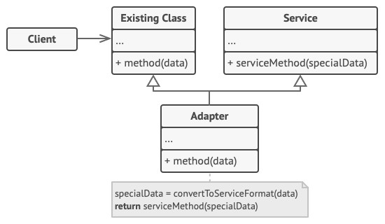

# Adapter - Адаптер
* Преобразует интерфейс класса к другому интерфейсу, на который рассчитан клиент.
* Позволяет объектам с несовместимыми интерфейсами работать вместе.

### Аналогия из реального мира
Адаптер (переходник) для видео, н-р, переходник с HDMI на VDI.

### Решаемые проблемы
* Использование сторонних классов с неподходящим интерфейсом.
* Использование полиморфным образом неродственных объектов.
* Рассогласованность реализации однотипных задач.

### Решение
* Создаётся адаптер - объект-переводчик, который трансформирует интерфейс или данные одного объекта в такой вид, чтобы он стал понятен другому объекту.
* Адаптер оборачивает один из объектов так, что другой объект даже не знает о его наличии, т.е. адаптер следует интерфейсу, который ожидает один объект от другого.
* Первый объект вызывает методы адаптера, адаптер передаёт выполнение второму объекту, вызывая нужные методы в нужном порядке.
* Адаптер может быть двусторонним.

### Диаграмма классов. Адаптер объектов
  
Эта реализация использует композицию: объект адаптера "оборачивает", то есть содержит ссылку на служебный объект.  
Новый класс реализует требуемый интерфейс и делегирует всю работу адаптируемому объекту, хранящемуся в виде закрытого поля.
1. `Client`. Клиент - это класс, который содержит существующую бизнес-логику программы.
2. `Client Interface`. Клиентский интерфейс описывает протокол, через который клиент может работать с другими классами.
3. `Service`. Сервис - это какой-то полезный класс, обычно сторонний.  
Клиент не может использовать этот класс напрямую, так как сервис имеет непонятный ему интерфейс.
4. `Adapter`. Адаптер - это класс, который может одновременно работать и с клиентом, и с сервисом.  
Он реализует клиентский интерфейс и содержит ссылку на объект сервиса.  
Адаптер получает вызовы от клиента через методы клиентского интерфейса, а затем переводит их в вызовы методов обёрнутого объекта в правильном формате.
5. Работая с адаптером через интерфейс, клиент не привязывается к конкретному классу адаптера.  
Благодаря этому, вы можете добавлять в программу новые виды адаптеров, независимо от клиентского кода.  
Это может пригодиться, если интерфейс сервиса вдруг изменится, например, после выхода новой версии сторонней библиотеки.

### Диаграмма классов. Адаптер классов
  
Эта реализация использует наследование: адаптер наследует оба интерфейса одновременно.  
Такой подход требует поддержки множественного наследования реализации.
1. Адаптер классов не нуждается во вложенном объекте, так как он может одновременно наследовать и часть существующего класса, и часть сервиса.
2. Наследование от адаптируемого объекта позволяет получить доступ к защищённому представлению, а также реализовать лишь несколько методов, если новый интерфейс не слишком отличается от интерфейса адаптируемого класса.

### Адаптер объектов VS Адаптер классов
| Адаптер объектов                                                       | Адаптер классов                                                                           |
|------------------------------------------------------------------------|-------------------------------------------------------------------------------------------|
| Использует композицию                                                  | Использует наследование                                                                   |
| Не требует поддержки множественного наследования                       | Требует поддержки множественного наследования                                             |
| Не имеет доступа к защищённому представлению адаптируемого класса      | Имеет доступ к защищённому представлению адаптируемого класса                             |
| Позволяет адаптировать не только отдельный класс, но и его наследников | Позволяет адаптировать только один адаптируемый класс                                     |
| Не может переопределять поведение адаптируемого класса                 | Может переопределять поведение адаптируемого класса                                       |
| Для работы необходим экземпляр и адаптера, и адаптируемого класса      | Для работы необходим только экземпляр адаптера, не требует экземпляр адаптируемого класса |

### Недостатки
* Усложняет код программы из-за введения дополнительных классов.
* Трудоёмкость создания адаптера когда интерфейсы целевого и адаптируемого класса сильно отличаются.

### Примеры использования
* Использование сторонних классов, интерфейсы которых сильно отличаются от остального кода приложения:
  * Данные приходят в формате XML, а обрабатывающая их библиотека работает только с форматом JSON.
  * Работа с разными единицами измерения – адаптер будет конвертировать значения.
* Сделать вызовы методов класса асинхронными.
* При рефакторинге:
  * Постепенное изменение существующей функциональности путём выделения нового "правильного" интерфейса, но с использованием старой проверенной функциональности.
  * Постепенный переход на другую внешнюю библиотеку.

### Примеры в .NET
* `TextReader`/`TextWriter` – адаптеры над классом `Stream` для чтения/записи текстовых данных в потоки ввода/вывода.
* `BinaryReader`/`BinaryWriter` – адаптеры над классом `Stream` для работы с бинарными данными потоков ввода/вывода
* `ReadonlyCollection<T>` - адаптирует произвольный список (`IList<T>`) в коллекции только для чтения (`IReadonlyCollection<T>`).
* LINQ-провайдеры – адаптируют классы для работы с внешним источником данных к интерфейсу `IQueryProvider`.

### Отношения с другими паттернами

#### Адаптер VS Декоратор
Общее: Адаптер и [Декоратор](../Decorator/Decorator.md) оборачивают объекты.

| Адаптер                                       | Декоратор                                           |
|-----------------------------------------------|-----------------------------------------------------|
| Меняет интерфейс существующего объекта        | Улучшает другой объект без изменения его интерфейса |
| Не поддерживает рекурсивную вложенность       | Поддерживает рекурсивную вложенность                |
| Предоставляет классу альтернативный интерфейс | Предоставляет классу расширенный интерфейс          |

#### Адаптер VS Фасад
Общее: Адаптер и [Фасад](../Facade/Facade.md) преобразуют интерфейсы других классов.

| Адаптер                                                                           | Фасад                                                   |
|-----------------------------------------------------------------------------------|---------------------------------------------------------|
| **Цель**: изменение интерфейса – приведение его к более удобному для клиента виду | **Цель**: упрощение интерфейса подсистемы               |
| Повторно использует старый интерфейс                                              | Задаёт новый интерфейс                                  |
| Изменяет доменную модель другой подсистемы                                        | Не изменяет доменную модель другой подсистемы           |
| Низкоуровневый интерфейс                                                          | Высокоуровневый интерфейс                               |
| Оборачивает как правило только один класс                                         | Оборачивает как правило целую подсистему                |
| _Вставляем круглый стержень в квадратное отверстие_                               | _Единая панель управления для запуска всех компонентов_ |
