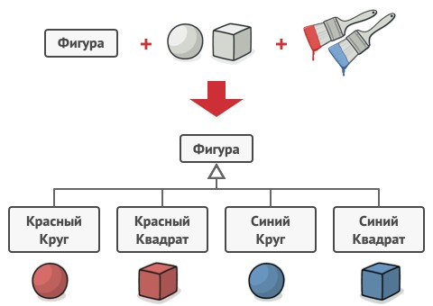
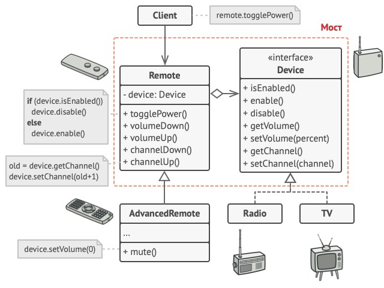
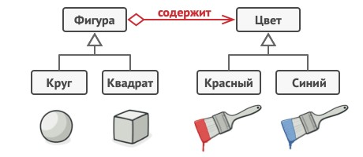
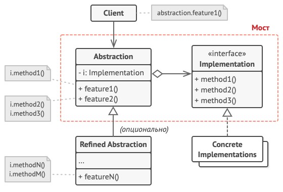

# Bridge - Мост
* Разделяет один или несколько классов на две отдельные иерархии - абстракцию и реализацию, позволяя изменять их независимо друг от друга.
* Абстракция - образный слой управления чем-либо.
  * Он не делает работу самостоятельно, а делегирует её реализации (иногда называемому платформой).

### Аналогия из реального мира
1. Геометрические фигуры.  
Есть класс `Фигура`, от которого наследуются классы `Круг` и `Квадрат`.  
Фигуры могут быть разных цветов, н-р, синие и красные.  
Можно завести отдельные классы для каждой фигуры и каждого цвета: `СинийКруг`, `СинийКвадрат`, `КрасныйКруг`, `КрасныйКвадрат`.  
НО: при добавлении новых цветов и новых типов фигур количество классов будет расти в геометрической прогрессии.  

2. Пульты и приборы.  
Разделяем устройства на приборы (выступают реализацией) и пульты для управления приборами (выступают абстракцией).  
Класс пульта имеет ссылку на объект прибора, которым он управляет.  
Пульты работают с приборами через общий интерфейс.  
Это даёт возможность связать пульты с различными приборами.  

### Решаемые проблемы
* При добавлении нового класса происходит взрывной рост дерева классов.
* Необходимо расширять класс в двух независимых плоскостях.
* Есть монолитный класс, который содержит несколько реализаций какой-то функциональности (н-р, работает с разными СУБД).
  * Изменение одной из реализаций может затронуть другие реализации.
* Необходимо изменять реализацию во время выполнения программы.
  * НО: в таком случае Мост будет выступать в роли [Стратегии](../Strategy/Strategy.md), это у него не главная задача.

### Решение
* Заменить наследование агрегацией или композицией.
  * Т.к. наследование жёстко привязывает реализацию к абстракции, что затрудняет независимую модификацию и переиспользование абстракции и её реализации.
* Для этого нужно выделить одну из плоскостей в отдельную иерархию классов и ссылаться на объект этой иерархии.
  * Такая связь между двумя иерархиями называется мостом.
  * Пример: отдельная иерархия для цветов, отдельная для фигур; `Фигура` содержит (ссылается на) `Цвет`.  
  
* При добавлении классов в одну иерархию не придётся менять другую иерархию (реализация OCP).

### Диаграмма классов

1. `Abstraction`. Абстракция содержит управляющую логику.  
Код абстракции делегирует реальную работу связанному объекту реализации.
2. `Implementation`. Реализация задаёт общий интерфейс для всех реализаций.  
Все методы, которые здесь описаны, будут доступны из класса абстракции и его подклассов.  
Интерфейсы абстракции и реализации могут как совпадать, так и быть совершенно разными.  
Но обычно в реализации живут базовые операции, на которых строятся сложные операции абстракции.
3. `ConcreteImplementations`. Конкретные реализации `Implementation`.
4. `RefinedAbstration`. Расширенные (уточнённые) абстракции содержат различные вариации управляющей логики.  
Как и родитель, работает с реализациями только через общий интерфейс реализации.
5. `Client`. Клиент работает только с объектами абстракции.  
Не считая начального связывания абстракции с одной из реализаций, клиентский код не имеет прямого доступа к объектам реализации.

### Недостатки
* Усложняет код из-за введения дополнительных классов.

### Примеры использования
* Разработка кросс-платформенных приложений.
* Поддержка нескольких типов СУБД.
* Работа с несколькими поставщиками похожего API (н-р, cloud-сервисы и соц. сети).

### Отношения с другими паттернами
