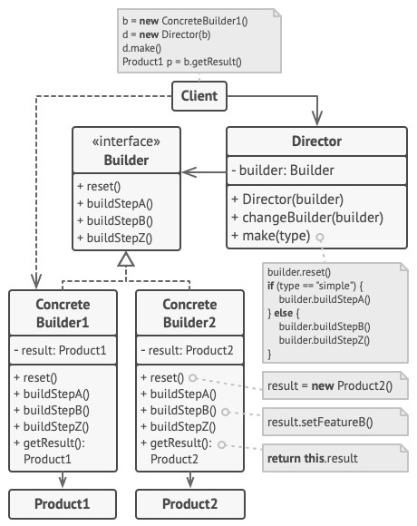

# Builder - Строитель
* Отделяет конструирование сложного объекта от его представления.
* Позволяет создавать сложные объекты пошагово.
* В результате конструирования могут получаться разные представления.

### Аналогия из реального мира
Строительство дома.  
Шаги: возвести стены, построить гараж, бассейн и т.д.  
Строителей может быть несколько, например, один строит дом из дерева, второй из бетона, третий из золота и бриллиантов. 

### Решаемые проблемы
* Создание сложных объектов размазано по всему коду.
* Большое количество подклассов для различных вариаций объекта.
* Длинный список параметров конструктора для охвата всех возможных представлений объекта.

### Решение
* Создание объекта выносится в отдельный класс-строитель.
* Процесс создания разбивается на отдельные шаги.
* Клиентский код вызывает нужные ему методы поочерёдно.
* Классов-строителей может быть несколько.
* Строители могут создавать экземпляры разных классов.
* Можно завести класс «Директор» для группировки шагов построения.

### Диаграмма классов

1. `Builder`. Интерфейс строителя объявляет шаги конструирования продуктов, общие для всех видов строителей.
2. `ConcreteBuilder`. Конкретные строители реализуют строительные шаги, каждый по-своему.  
Конкретные строители могут производить разнородные объекты, не имеющие общего интерфейса.
3. `Product`. Продукт - создаваемый объект. Продукты, сделанные разными строителями, не обязаны иметь общий интерфейс.
4. `Director`. Директор определяет порядок вызова строительных шагов для производства той или иной конфигурации продуктов.
5. `Client`. Обычно Клиент подаёт в конструктор директора уже готовый объект-строитель, и в дальнейшем данный директор использует только его.  
Но возможен и другой вариант, когда клиент передаёт строителя через параметр строительного метода директора.  
В этом случае можно каждый раз применять разных строителей для производства различных представлений объектов.

### Недостатки
* Введение дополнительных классов.
* Может возникнуть необходимость дополнительно контролировать, когда объект будет готов.

### Примеры использования
1. LINQ-выражения.
2. Extension-методы.
3. Класс `StringBuilder`.
4. Настройка зависимостей.
5. Генерация XML и JSON.
6. Настройка моков и генерация тестовых данных в тестах.

### Отношения с другими паттернами
* Строитель позволяет пошагово сооружать дерево [Компоновщика](../Composite/Composite.md).
* Паттерн Строитель может быть построен в виде [Моста](../Bridge/Bridge.md): директор будет играть роль абстракции, а строители — реализации.
* [Абстрактная фабрика](../AbstractFactory/AbstractFactory.md), Строитель и [Прототип](../Prototype/Prototype.md) могут быть реализованы при помощи [Одиночки](../Singleton/Singleton.md).
* Строитель концентрируется на построении сложных объектов шаг за шагом, а [Абстрактная фабрика](../AbstractFactory/AbstractFactory.md) специализируется на создании семейств связанных продуктов.
  * Строитель возвращает продукт только после выполнения всех шагов, а Абстрактная фабрика возвращает продукт сразу же.
