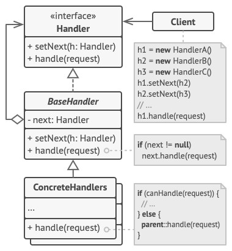

# Chain of Responsibility (Chain of Command) - Цепочка обязанностей
* Позволяет передавать запросы последовательно по цепочке обработчиков.
  * Каждый последующий обработчик решает, может ли он обработать запрос сам и стоит ли передавать запрос дальше по цепи.
* Другими словами: позволяет избежать привязки отправителя запроса к его получателю, предоставляя возможность обработать запрос нескольким объектам.
  * Связывает объекты-получатели в цепочку и передаёт запрос по этой цепочке, пока он не будет обработан или пока не закончится цепочка.

### Аналогия из реального мира
Общение клиента с службой поддержки.  
Клиент звонит в службу поддержки и сначала попадает на первую линию.  
Если там клиенту не смогли помочь, его переводят на другого специалиста, и дальше по цепочке, при необходимости.

### Решаемые проблемы
* Когда нужно обрабатывать разнообразные запросы несколькими способами, но заранее неизвестно, какие конкретно запросы будут приходить и какие обработчики для них понадобятся.
  * С помощью Цепочки обязанностей можно связать потенциальных обработчиков в одну цепь и при получении запроса поочерёдно опрашивать каждого из них, может ли он обработать запрос.
* Когда важен порядок выполнения обработчиков.
  * Цепочка обязанностей позволяет запускать обработчики последовательно в том порядке, в котором они находятся в цепочке.
* Когда набор обработчиков должен формироваться динамически.
  * В любой момент в цепочке можно переназначать связи, убирать или добавлять звенья.

### Решение
* Каждое поведение выносится в отдельный класс.
* Объекты обработчиков связываются в одну цепочку.
  * При получении запроса обработчик может не только сам что-то с ним сделать, но и передать обработку следующему обработчику в цепочке.
* В классической версии паттерна цепочка обрывается, если нашёлся элемент, который **может** обработать запрос.
  * Но можно сделать и наоборот: обрывать цепочку когда элемент **не может** обработать запрос.
* Все объекты цепочки должны иметь общий интерфейс.
  * Каждому конкретному обработчику достаточно знать, что следующий объект цепи имеет метод `Handle`.
  * Благодаря этому связи между объектами цепочки будут гибкими.
* Цепочки можно формировать динамически, не привязываясь к конкретным классам.
* Длина цепочки не имеет значения.
* Клиент может отправить запрос любому объекту из цепочки, не обязательно самому первому.
* Реализует принципы SRP и OCP.

### Диаграмма классов

1. `Handler`. Обработчик определяет общий для всех конкретных обработчиков интерфейс.  
Обычно достаточно описать единственный метод обработки запросов, но здесь может быть объявлен и метод выставления следующего обработчика.
2. `BaseHandler`. Базовый обработчик - опциональный класс, который позволяет избавиться от дублирования одного и того же кода во всех конкретных обработчиках.  
Обычно этот класс имеет поле для хранения ссылки на следующий обработчик в цепочке.  
Клиент связывает обработчики в цепь, подавая ссылку на следующий обработчик через конструктор или сеттер поля.  
Также здесь можно реализовать базовый метод обработки, который бы просто перенаправлял запрос следующему обработчику, проверив его наличие.
3. `ConcreteHandler`. Конкретные обработчики содержат код обработки запросов.  
При получении запроса каждый обработчик решает, может ли он обработать запрос, а также стоит ли передать его следующему объекту.
В большинстве случаев обработчики могут работать сами по себе и быть неизменяемыми, получив все нужные детали через параметры конструктора.
4. `Client`. Клиент может либо сформировать цепочку обработчиков единожды, либо перестраивать её динамически, в зависимости от логики программы.

### Недостатки
* Запрос может остаться никем не обработанным.
  * Нет гарантий, что кто-то его обработает.
* Цепочки могут усложнять отслеживание запросов и отладку.
* Избыточность.
  * Если объектов в цепочке слишком много, то запрос может проходить через все объекты, что может привести к избыточной обработке.
* Возможность образования бесконечных циклов.

### Примеры использования
* Middleware - промежуточные обработчики HTTP-запросов.
  * Аутентификация, авторизация, валидация, кеширование, обработка исключений.
* Обработка событий элементов GUI.
  * Событие передаётся вверх по иерархии объектов до тех пор, пока не найдётся объект, способный его обработать.
* Выбор, на какого сотрудника назначить задачу.
* Выбор способа оплаты заказа.

### Примеры в .NET
* Событие `Closing` в Windows Forms с возможностью отмены закрытия формы путём установки свойства `Cancel` аргумента `CancelEventArgs` в `true`.
* Событие `TaskScheduler.UnobservedException`, обработчик которого может уведомить планировщик, что необработанное исключение задачи не является критическим, путём вызова метода `UnobservedTaskExceptionEventArgs.SetObserved`.
  * Для аналогичных целей используются события `Contract.ContractFailed` и `Application.DispatcherUnhandledException`.
