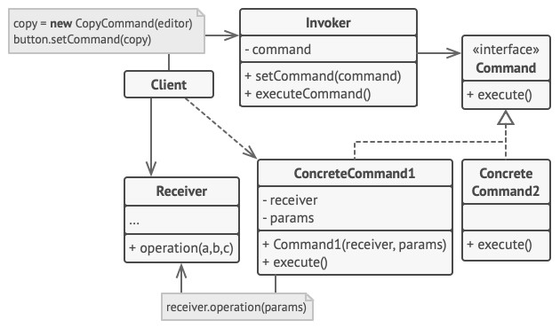

# Command (Action, Transaction) - Команда (Действие, Транзакция)
* Инкапсулирует запросы на выполнение определённого действия в объекты, позволяя передавать их как аргументы при вызове методов.
* Этот объект запроса и называется командой.
* Другими словами: Команда отделяет сторону, выдающую запрос, от объекта, фактически выполняющего операцию.

### Аналогия из реального мира
Заказ в ресторане.  
Официант принимает заказ у клиента и записывает в блокнот.  
Затем официант передаёт листок с заказом повару, который готовит заказанные блюда.  
Клиент не взаимодействует с поваром напрямую.  
Повар не знает, кто именно послал ему заказ - вся нужная ему информация записана на листке.

В данном случае:
* Клиент - это отправитель.
* Официант с блокнотом - это команда.
* Повар - это получатель.

### Решаемые проблемы
* Когда надо передавать в качестве параметров определенные действия, вызываемые в ответ на другие действия.
  * Т.е. когда необходимы функции обратного действия в ответ на определенные действия.
  * Команда превращает операции в объекты, а объекты можно передавать, хранить и взаимозаменять внутри других объектов.
* Когда нужно ставить операции в очередь, выполнять их по расписанию или передавать по сети.
  * Объекты команд можно сериализовать и сохранить в файл или базу данных, а затем вычитать, превратить в объект и выполнить.
  * Таким же образом можно передавать команды по сети, логировать или выполнять на удалённом сервере.
* Когда нужна операция отмены. Есть несколько способов её реализации:
  1. Хранение истории операций.
     * История операций хранится в виде стека, в который попадают все выполненные объекты команд.
     * Команда перед выполнением операции сохраняет текущее состояние объекта, с которым она будет работать.
     * После выполнения операции копия команды попадает в стек истории, неся в себе сохранённое состояние объекта.
     * Когда потребуется отмена, программа возьмёт последнюю команду из истории и возобновит сохранённое в ней состояние.
     * Особенности хранения истории:
       1. Сохранить точное состояние объекта может быть непросто, т.к. у него могут быть приватные поля.
          * С этим может помочь паттерн [Снимок](../Memento/Memento.md).
       2. Копии состояния могут занимать много оперативной памяти.
  2. Команда выполняет обратное действие.
     * Минус: реализовать обратное действие может быть сложно или невозможно.

### Решение
* Каждый запрос заворачивается в собственный класс с единственным методом, который и будет осуществлять запрос.
* Объекты, отправляющие запросы, не знают, кто будет получателем запроса.
  * Параметры вызова скрыты внутри команды.
* При вызове клиенты будут делегировать работу связанным командам, а команды будут перенаправлять вызовы нужным объектам бизнес-логики.
* Команда может самостоятельно выполнить запрос вместо того, чтобы делегировать его получателю.
* Можно создать макрокоманду - команду, которая выполняет цепочку команд.
  * Макрокоманда содержит в себе список команд, каждую из которых нужно будет выполнить по запросу клиента.
  * Этот список макрокоманда либо принимает от клиента, либо формирует сама.
  * В общем случае макрокоманды описываются паттерном [Компоновщик](../Composite/Composite.md).

### Диаграмма классов

1. `Invoker`. Отправитель хранит ссылку на объект команды и обращается к нему, когда нужно выполнить какое-то действие.  
Отправитель работает с командами только через их общий интерфейс.  
Он не знает, какую конкретно команду использует, так как получает готовый объект команды от клиента.
2. `Command`. Команда описывает общий для всех конкретных команд интерфейс.  
Обычно здесь описан всего один метод для запуска команды.
3. `ConcreteCommand`. Конкретные команды реализуют различные запросы, следуя общему интерфейсу команд.  
Обычно команда не делает всю работу самостоятельно, а лишь передаёт вызов получателю, которым является один из объектов бизнес-логики.  
Параметры, с которыми команда обращается к получателю, следует хранить в виде полей.  
В большинстве случаев объекты команд можно сделать неизменяемыми, передавая в них все необходимые параметры только через конструктор.
4. `Receiver`. Получатель содержит бизнес-логику программы.  
В этой роли может выступать практически любой объект.  
Обычно команды перенаправляют вызовы получателям.  
Но иногда, чтобы упростить программу, можно избавиться от получателей, переместив их код в классы команд.
5. `Client`. Клиент создаёт объекты конкретных команд, передавая в них все необходимые параметры, среди которых могут быть и ссылки на объекты получателей.  
После этого клиент связывает объекты отправителей с созданными командами.

### Недостатки
* Усложнение кода программы из-за введения множества дополнительных классов.
* Может повлечь за собой дополнительные затраты памяти из-за хранения истории команд и других данных состояния каждой команды.

### Примеры использования
* Обработчики событий элементов GUI (т.е. команды будут прослойкой между GUI и бизнес-логикой).
* Реализация операции отмены и повторения в процессе редактирования документа.
* Загрузка данных с удалённого сервера по частям.
* Запись макросов.
  * Запись последовательности действий пользователя в виде команд, которые потом можно будет воспроизвести в том же порядке.
* Реализация индикатора выполнения задач.
  * Если каждый объект команды имеет метод для получения оценочной длительности, программа может оценить общую продолжительность процесса.
  * Она может показать индикатор выполнения, который отражает, насколько близка программа к завершению всех задач.
* CQRS.

### Примеры в .NET
* Объект класса `Task<T>` принимает делегат `Func<T>`, который можно рассматривать в виде команды, которая будет исполнена в будущем для получения результата задачи.
* Интерфейс `IDbCommand` в ADO.NET инкапсулирует операцию, исполняемую на стороне СУБД.
* На основе интерфейса `ICommand` в WPF строится привязка операций к событиям пользовательского интерфейса.
