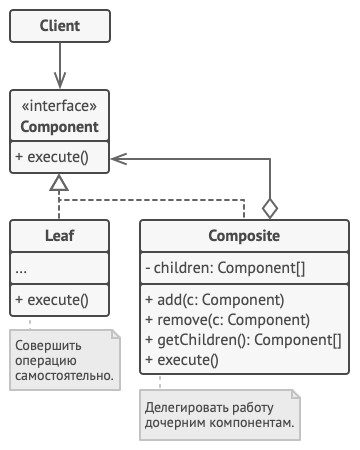

# Composite - Компоновщик
* Объединяет группу объектов в древовидную структуру по принципу "часть-целое".
* Позволяет клиенту одинаково работать как с отдельными объектами, так и с группой объектов.
* Компоновщик имеет смысл только когда модель может быть структурирована в виде дерева.

### Аналогия из реального мира
Есть Коробки и Продукты. В Коробке могут находится Продукты или другие Коробки и т.д.  
Задача: посчитать стоимость всех продуктов.

### Решаемые проблемы
* Когда нужно представить древовидную структуру объектов.
  * Паттерн Компоновщик предлагает хранить в составных объектах ссылки на другие простые или составные объекты.
  * Те, в свою очередь, тоже могут хранить свои вложенные объекты и так далее.
  * В итоге можно строить сложную древовидную структуру данных, используя всего две основные разновидности объектов.
* Необходимо выполнить одну и ту же операцию сразу для всех компонентов, при этом заранее неизвестны:
  * Типы контейнеров и примитивов.
  * Количество уровней вложенности.
* Когда клиенты должны единообразно трактовать простые и составные объекты.
  * Благодаря тому, что простые и составные объекты реализуют общий интерфейс, клиенту безразлично, с каким именно объектом ему предстоит работать.

### Решение
* Контейнер и примитив рассматриваются через единый интерфейс с общими методами.
* Каждый контейнер будет рекурсивно вызывать соответствующий метод у содержащихся в нём компонентов.
* Клиент не будет знать о точной структуре компонентов.
* Т.о. клиент будет единообразно трактовать контейнеры и примитивы.

### Диаграмма классов

1. `Component` определяет общий интерфейс для простых и составных компонентов дерева.
2. `Leaf` - это простой компонент дерева, не имеющий ответвлений.  
Из-за того, что им некому больше передавать выполнение, классы листьев будут содержать большую часть полезного кода.
3. `Composite` (или Контейнер) - это составной компонент дерева.  
Он содержит набор дочерних компонентов, но ничего не знает об их типах.  
Это могут быть как простые компоненты-листья, так и другие компоненты-контейнеры.  
Но это не является проблемой, если все дочерние компоненты следуют единому интерфейсу.  
Методы контейнера переадресуют основную работу своим дочерним компонентам, хотя и могут добавлять что-то своё к результату.
4. `Client` работает с деревом через общий интерфейс компонентов.  
Благодаря этому, клиенту не важно, что перед ним находится - простой или составной компонент дерева.

### Недостатки
Куда добавить методы `Add`/`Remove`?
1. В класс `Composite`.
    * У примитивов и контейнеров будут разные интерфейсы.
    * Часть клиентов будет знать о классе `Composite`.
    * Может подойти, если процессы формирования и использования компонентов чётко разделены.
2. В интерфейс `Component`.
   * Класс `Leaf` не сможет их нормально реализовать (нарушение LSP).
       * Методы не будут ничего не делать, либо будут возвращать `null` или `false`, либо генерировать `InvalidOperationException`.
   * Может подойти, если контейнер является базовым сценарием, а примитив - частным случаем.
3. В отдельное место.
   * Классы компонентов будут неизменяемыми.
   * Отпадает необходимость в методах `Add`/`Remove`.
   * Контейнер будет формироваться конструктором или фабричным методом.

### Примеры использования
* Элементы GUI.
* Деревья выражений.
* Работа с XML и JSON.
* Работа с файловой системой.
* Геометрические фигуры, когда одна фигура состоит из других фигур.
* Иерархия сотрудников в организации.

### Примеры в .NET
* Компоненты пользовательского интерфейса
  * `System.Windows.Forms.Control` - WindowsForms.
  * `System.Windows.FrameworkElement` - WPF.
  * `System.Web.UI.WebControls.CompositeControl` - ASP.NET.
* `XmlNode`, `XElement` для работы с XML.
* `System.Linq.Expressions.Expression` - деревья выражений.

### Отношения с другими паттернами
* Можно обходить дерево Компоновщика, используя [Итератор](../Iterator/Iterator.md).
* Паттерн Компоновщик можно использовать для реализации [макрокоманд](../Command/Command.md).
* [Цепочку обязанностей](../ChainOfResponsibility/ChainOfResponsibility.md) можно использовать вместе с Компоновщиком.
  * В этом случае запрос передаётся от дочерних компонентов к их родителям.
* Можно выполнить какое-то действие над всем деревом Компоновщика при помощи [Посетителя](../Visitor/Visitor.md).
* Компоновщик можно совмещать с [Легковесом](../Flyweight/Flyweight.md), чтобы реализовать общие ветки дерева и сэкономить при этом память.
* [Строитель](../Builder/Builder.md) позволяет пошагово сооружать дерево Компоновщика.
* Архитектура, построенная на Компоновщиках и [Декораторах](../Decorator/Decorator.md), может быть улучшена за счёт внедрения [Прототипа](../Prototype/Prototype.md) - он позволяет клонировать сложные структуры объектов, а не собирать их заново.

#### Компоновщик VS Декоратор
Общее: Компоновщик и [Декоратор](../Decorator/Decorator.md) имеют похожие структуры классов из-за того, что оба построены на рекурсивной вложенности.  
Она позволяет связать в одну структуру бесконечное количество объектов.

| Компоновщик                                           | Декоратор                                           |
|-------------------------------------------------------|-----------------------------------------------------|
| Не добавляет нового, суммирует результаты своих детей | Добавляет вложенному объекту новую функциональность |
| Узел Компоновщика может иметь много детей             | Оборачивает только один объект                      |

Компоновщик может использовать Декоратор чтобы переопределить функции отдельных частей дерева компонентов.
