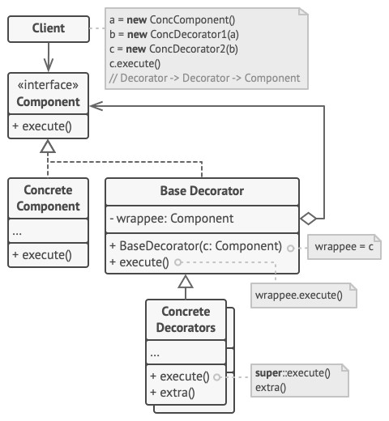

# Decorator - Декоратор
* Позволяет динамически добавлять объектам новую функциональность, оборачивая их в полезные "обёртки".
* Поведение существующих классов при этом не меняется.

### Аналогия из реального мира
Одежда - аналог Декоратора.  
* При надевании одежды человек не перестаёт быть самим собой.
* Одежда даёт новые свойства: свитер добавляет защиту от холода, плащ - защиту от дождя.
* Можно надевать одновременно несколько вещей.

### Решаемые проблемы
* Необходимо гибко добавлять обязанности для объектов на лету, незаметно для клиентского кода.
* Нельзя расширить функциональность через наследование (`sealed class`).
* Механизм наследования не обеспечивает должной гибкости.

### Решение
* Класс помещается в обёртку, которая и запускает базовое поведение класса, и добавляет что-то своё (принцип OCP).
  * Поведение может добавляться и до, и после.
* Декоратор и декорируемый объект имеют один и тот же интерфейс.
  * Клиент не знает, с чем именно он работает - с чистым объектом или с обёрнутым.
* Объект можно завернуть в один или несколько декораторов.
* Объект может быть декорирован в любой момент времени.

### Диаграмма классов

1. `Component` задаёт общий интерфейс обёрток и оборачиваемых объектов.
2. `ConcreteComponent` определяет класс оборачиваемых объектов.  
Он содержит какое-то базовое поведение, которое потом изменяют декораторы.
3. `BaseDecorator` хранит ссылку на вложенный объект-компонент.  
Им может быть как конкретный компонент, так и один из конкретных декораторов.  
Базовый декоратор делегирует все свои операции вложенному объекту.  
Дополнительное поведение будет жить в конкретных декораторах.
4. `ConcreteDecorators` - это различные вариации декораторов, которые содержат добавочное поведение.  
Оно выполняется до или после вызова аналогичного поведения обёрнутого объекта.
5. `Client` может оборачивать простые компоненты и декораторы в другие декораторы, работая со всеми объектами через общий интерфейс компонентов.

### Композиция VS Наследование
* Наследование статично.
  * Нельзя изменить поведение существующего объекта.
* Наследование не разрешает наследовать поведение нескольких классов одновременно.
  * Нужно создавать подклассы-комбинации для получения совмещённого поведения.
* Наследование обеспечивает более жёсткую связь по сравнению с агрегацией.
  * Декораторы оказываются привязаны к своему базовому классу и не могут быть использованы с другой реализацией интерфейса `Component`.
* Агрегация позволяет нанизывать несколько декораторов друг на друга, создавая сложное поведение.
  * Использование наследования могло бы привести к комбинаторному взрыву числа наследников. 

### Недостатки
* Более сложный код для создания объекта, т.к. нужно его нужно ещё и оборачивать.
* Чувствительность к порядку вложенности декораторов.
* Может появиться большое количество мелких классов.
  * Разобраться в них может быть непросто.
* Если код зависит от типа конкретного компонента, декораторы нарушат его работоспособность.
  * Н-р, если скидка распространяется только на базовую вещь, но не на добавленные опции.

### Примеры использования
* Оповещения о работе приложения: через email, мессенджер, SMS и пр.
* Шифрование результата работы методов.
* Замер времени выполнения методов.
* Кэширование.
* Логирование аргументов.
* Управление доступом пользователей.
* Троттлинг - включение режима ограничения входящих запросов при достижении определённого лимита.
* Прочее поведение, не являющееся частью основной функциональности.

### Примеры в .NET
* `System.IO.BufferedStream` - добавляет буферизацию потоку ввода/вывода.
* `System.IO.Compression.GZipStream`, `System.IO.Compression.DeflateStream` - добавляют возможности сжатия потоку ввода/вывода.
* `System.CodeDom.Compiler.IndentedTextWriter` - управляет форматированием объекта `System.IO.TextWriter`.
* `System.Reflection.TypeDelegator` - декоратор для добавления дополнительных аспектов поведения объекту `System.Type`.
* `System.Collections.SortedList.SyncSortedList` - декоратор, который является вложенным классом в `SortedList` и вызывает все методы декорируемого списка внутри конструкции `lock`.

### Отношения с другими паттернами
* [Цепочка обязанностей](../ChainOfResponsibility/ChainOfResponsibility.md) и Декоратор имеют очень похожие структуры и базируются на принципе рекурсивного выполнения операции через серию связанных объектов. Но есть и отличия:
  * Обработчики в Цепочке обязанностей могут выполнять произвольные действия, независимые друг от друга, а также в любой момент прерывать дальнейшую передачу по цепочке.
  * С другой стороны Декораторы расширяют какое-то определённое действие, не ломая интерфейс базовой операции и не прерывая выполнение остальных декораторов.
* [Стратегия](../Strategy/Strategy.md) меняет поведение объекта "изнутри", а Декоратор изменяет его "снаружи".
* [Адаптер](../Adapter/Adapter.md) предоставляет классу альтернативный интерфейс, Декоратор предоставляет расширенный интерфейс, [Заместитель](../Proxy/Proxy.md) предоставляет тот же интерфейс.
* Архитектура, построенная на [Компоновщиках](../Composite/Composite.md) и Декораторах, может быть улучшена за счёт внедрения [Прототипа](../Prototype/Prototype.md) - он позволяет клонировать сложные структуры объектов, а не собирать их заново.

#### Декоратор VS Адаптер
Общее: Декоратор и [Адаптер](../Adapter/Adapter.md) оборачивают объекты.

| Декоратор                                           | Адаптер                                       |
|-----------------------------------------------------|-----------------------------------------------|
| Улучшает другой объект без изменения его интерфейса | Меняет интерфейс существующего объекта        |
| Поддерживает рекурсивную вложенность                | Не поддерживает рекурсивную вложенность       |
| Предоставляет классу расширенный интерфейс          | Предоставляет классу альтернативный интерфейс |

#### Декоратор VS Компоновщик
Общее: Декоратор и [Компоновщик](../Composite/Composite.md) имеют похожие структуры классов из-за того, что оба построены на рекурсивной вложенности.  
Она позволяет связать в одну структуру бесконечное количество объектов.

| Декоратор                                           | Компоновщик                                           |
|-----------------------------------------------------|-------------------------------------------------------|
| Добавляет вложенному объекту новую функциональность | Не добавляет нового, суммирует результаты своих детей |
| Оборачивает только один объект                      | Узел Компоновщика может иметь много детей             |

Компоновщик может использовать Декоратор чтобы переопределить функции отдельных частей дерева компонентов.

#### Декоратор VS Заместитель
Общее: Декоратор и [Заместитель](../Proxy/Proxy.md)
* Построены на принципе композиции.
* Делегируют работу другим объектам.

| Декоратор                                          | Заместитель                                         |
|----------------------------------------------------|-----------------------------------------------------|
| **Цель**: добавление нового поведения для объекта  | **Цель**: управление доступом к объекту             |
| Предоставляет классу расширенный интерфейс         | Предоставляет классу тот же интерфейс               |
| Обёртывание декораторами контролируется клиентом   | Заместитель сам управляет жизнью сервисного объекта |
