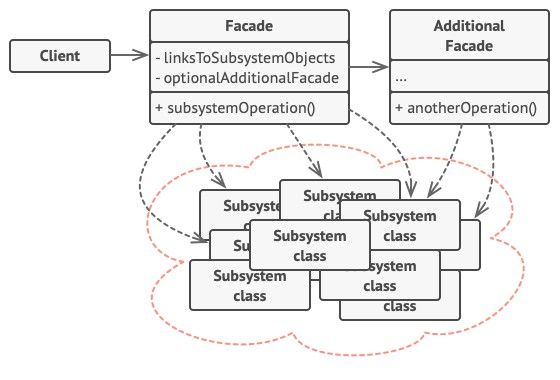

# Facade - Фасад
* Предоставляет простой интерфейс к сложной системе классов или библиотеке.
* Упрощает использование подсистемы за счёт введения интерфейса более высокого уровня.

### Аналогия из реального мира
Кол-центр является фасадом ко всем службам магазина.  
Он предоставляет упрощённый интерфейс к системе создания заказа, платёжной системе и отделу доставки.

### Решаемые проблемы
* Сложности при использовании внешних библиотек.
* Бизнес-логика тесно переплетается с деталями реализации сторонних библиотек – код становится сложным для изменения, завязывается на конкретную библиотеку.
* При обновлении версии сторонней библиотеки необходимо протестировать большой объём кода.
* Сложности при взаимодействии одного функционального блока с другим в рамках одного приложения.
  * Можно использовать фасады для определения точек входа на каждый уровень подсистемы.
  * Подсистемы будут обмениваться информацией только через фасады.

### Решение
* Создаётся объект-фасад, берущий на себя все сложности по работе с подсистемой и предоставляющий для клиентов более удобный интерфейс.
* Фасад может покрывать не всю функциональность подсистемы, а только нужную клиентам часть.
* Фасад может сам следить за жизненным циклом подсистемы.
* Предоставляемый фасадом интерфейс может быть специфичным для приложения.
* При необходимости клиент может по-прежнему обращаться к подсистеме напрямую.

### Диаграмма классов

1. `Facade`. Фасад предоставляет быстрый доступ к определённой функциональности подсистемы.  
Он "знает", каким классам нужно переадресовать запрос, и какие данные для этого нужны.
2. `AdditionalFacade`. Дополнительный фасад можно ввести, чтобы не "захламлять" единственный фасад разнородной функциональностью.  
Он может использоваться как клиентом, так и другими фасадами.
3. `Subsystem classes`. Сложная подсистема состоит из множества разнообразных классов.  
Для того, чтобы заставить их что-то делать, нужно знать подробности устройства подсистемы, порядок инициализации объектов и т.д.  
Классы подсистемы не знают о существовании фасада и работают друг с другом напрямую.
4. `Client`. Клиент использует фасад вместо прямой работы с объектами сложной подсистемы.

### Недостатки
* Фасад рискует стать God Object, привязанным ко всем объектам приложения.
* Фасад может быть бесполезным, если будет иметь громоздкий интерфейс.

### Примеры использования
* Работа с внешними библиотеками через фасад:
  * Генерация файлов: json, xml, docx, xlsx и pdf и пр.
  * Взаимодействие с БД, Message Queue.
  * Логирование.

### Примеры в .NET
* `XmlSerializer` – прячет сложность сериализации, генерацию временной сборки и другие низкоуровневые подробности.
* `Parallel` – фасад для упрощения параллельного программирования, прячет низкоуровневые детали планировщиков, стратегии разбивки данных и другие подробности создания объектов `Task<T>` и управления ими.
* `System.Console` – фасад для работы с консолью ввода-вывода.

### Отношения с другими паттернами
* Фасад похож на [Заместитель](../Proxy/Proxy.md) тем, что замещает сложную подсистему и может сам её инициализировать.
  * Но в отличие от Фасада, Заместитель имеет тот же интерфейс, что его служебный объект, благодаря чему их можно взаимозаменять.
* [Абстрактная фабрика](../AbstractFactory/AbstractFactory.md) может быть использована вместо Фасада для того, чтобы скрыть платформо-зависимые классы.
* Фасад можно сделать [Одиночкой](../Singleton/Singleton.md), так как обычно нужен только один объект-фасад.

#### Фасад VS Адаптер
Общее: Фасад и [Адаптер](../Adapter/Adapter.md) преобразуют интерфейсы других классов.

| Фасад                                                   | Адаптер                                                                           |
|---------------------------------------------------------|-----------------------------------------------------------------------------------|
| **Цель**: упрощение интерфейса подсистемы               | **Цель**: изменение интерфейса – приведение его к более удобному для клиента виду |
| Задаёт новый интерфейс                                  | Повторно использует старый интерфейс                                              |
| Не изменяет доменную модель другой подсистемы           | Изменяет доменную модель другой подсистемы                                        |
| Высокоуровневый интерфейс                               | Низкоуровневый интерфейс                                                          |
| Оборачивает как правило целую подсистему                | Оборачивает как правило только один класс                                         |
| _Единая панель управления для запуска всех компонентов_ | _Вставляем круглый стержень в квадратное отверстие_                               |

#### Фасад VS Посредник
Общее: Фасад и [Посредник](../Mediator/Mediator.md) организуют работу множества существующих классов.

| Фасад                                                                                   | Посредник                                                                                 |
|-----------------------------------------------------------------------------------------|-------------------------------------------------------------------------------------------|
| **Цель**: Создать упрощённый интерфейс к подсистеме, не внося новой функциональности    | **Цель**: Централизовать общение между компонентами системы                               |
| Подсистема не знает о существовании Фасада                                              | Компоненты знают о существовании Посредника                                               |
| Классы подсистемы общаются друг с другом напрямую                                       | У компонентов нет прямого доступа к другим компонентам                                    |
| Однонаправленный протокол - Фасад отправляет запросы классам подсистемы, но не наоборот | Двунаправленный протокол - Посредник может и отправлять и получать запросы от компонентов |
