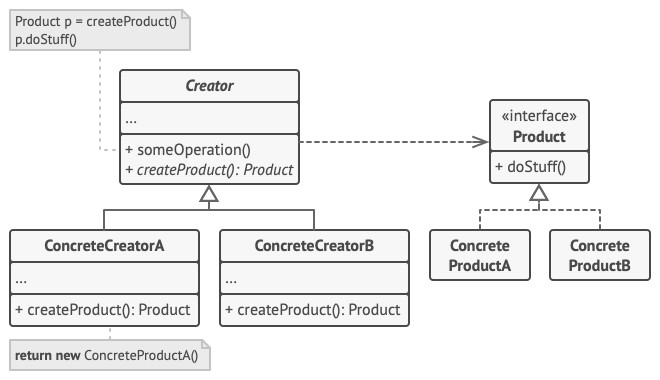

# Factory Method - Фабричный метод
* Определяет общий интерфейс для создания объектов в базовом классе, позволяя классам-наследникам выбрать класс создаваемого экземпляра.
* Фабричный метод делегирует операцию создания экземпляра классам-наследникам.

### Аналогия из реального мира
Пиццерия:
* Производит несколько видов пицц: Пепперони, Сырная, Вегетарианская и пр.
* В разных городах один и тот же вид пиццы должен состоять из разных ингредиентов (разные стили пиццы).
* Поэтому для каждого города создаётся своя фабрика пицц.

### Решаемые проблемы
* Код завязан на конкретном типе объекта и его приходится переписывать при добавлении новых типов.
* Создание объекта не отделено от его использования – типы объектов должны быть известны заранее.
* Нужна возможность для создания новых типов при отсутствии возможности переписать имеющиеся типы (реализация OCP).
* Есть необходимость в использовании ранее созданных объектов вместо создания новых, в частности, когда процесс создания объекта сложный и/или долгий.

### Решение
* Объекты создаются не напрямую, а через вызов фабричного метода (может быть абстрактным).
* Фабричные методы можно переопределять в дочерних классах, чтобы они могли изменить тип возвращаемого объекта.
* Возвращаемые объекты должны иметь общий интерфейс.
* Фабричный метод может не создавать новый объект, а возвращать созданный ранее.

### Диаграмма классов

1. `Product`. Продукт определяет общий интерфейс объектов, которые может произвести создатель и его подклассы.
2. `ConcreteProduct`. Конкретные продукты содержат код различных продуктов. Продукты будут отличаться реализацией, но интерфейс у них будет общий.
3. `Creator`. Создатель объявляет фабричный метод, который должен возвращать новые объекты продуктов. Важно, чтобы тип результата совпадал с общим интерфейсом продуктов.  
Зачастую фабричный метод объявляют абстрактным, чтобы заставить все подклассы реализовать его по-своему. Но он может возвращать и некий стандартный продукт.  
Несмотря на название, важно понимать, что создание продуктов не является единственной функцией создателя.  
Обычно он содержит и другой полезный код работы с продуктом.  
Аналогия: большая софтверная компания может иметь центр подготовки программистов, но основная задача компании - создавать программные продукты, а не готовить программистов.
4. `ConcreteCreator`. Конкретные создатели по-своему реализуют фабричный метод, производя те или иные конкретные продукты.  
Фабричный метод не обязан всё время создавать новые объекты.  
Его можно переписать так, чтобы возвращать существующие объекты из какого-то хранилища или кэша.

### Недостатки
* Может привести к созданию больших параллельных иерархий классов, т.к. для каждого класса продукта нужно создавать свой дочерний класс создателя.

### Примеры использования
1. В качестве именованных конструкторов. Например, фабричные методы в структуре `TimeSpan`:
   * `TimeSpan FromSeconds(double value)`
   * `TimeSpan FromMinutes(double value)`
2. Когда создание объекта – процесс сложный и/или долгий.  
Н-р, когда выполняется обращение к внешним ресурсам.  
Фабричный метод можно сделать асинхронным.
3. Когда необходимо кэшировать созданные ранее объекты.

### Примеры в .NET
* Классический фабричный метод:
  * `Stream.CreateWaitHandle`, `SecurityAttribute.CreatePermission`, `ChannelFactory.CreateChannel`, `XmlNode.CreateNavigator`.
* Обобщёная статическая фабрика:
  * `Activator.CreateInstance`, `Array.CreateInstance`, `StringComparer.Create`.
* Фасадные фабричные методы:
  * `File.Create`, `File.CreateText`.
* Именованные конструкторы:
  * `TimeSpan.FromSeconds` и т.п., `Color.FromArgb`.

### Отношения с другими паттернами
* Фабричный метод можно использовать вместе с [Итератором](../Iterator/Iterator.md), чтобы подклассы коллекций могли создавать подходящие им итераторы.
* [Прототип](../Prototype/Prototype.md) не опирается на наследование, но ему нужна сложная операция инициализации, в то время, как Фабричный метод, наоборот, построен на наследовании, но не требует сложной инициализации.

#### Фабричный метод VS Абстрактная фабрика
Общее: Фабричный метод и [Абстрактная фабрика](../AbstractFactory/AbstractFactory.md) создают объекты различных классов.

| Фабричный метод         | Абстрактная фабрика         |
|-------------------------|-----------------------------|
| Создаёт один продукт    | Создаёт семейство продуктов |
| Использует наследование | Использует композицию       |

#### Фабричный метод VS Шаблонный метод
Общее: Фабричный метод и [Шаблонный метод](../TemplateMethod/TemplateMethod.md) делегируют реализации поведения потомкам.

| Фабричный метод                                 | Шаблонный метод                          |
|-------------------------------------------------|------------------------------------------|
| Делегирует потомкам реализацию создания объекта | Делегирует потомкам реализацию поведения |
| Полностью откладывает создание объекта          | Частично откладывает поведение           |

Фабричный метод можно рассматривать как частный случай Шаблонного метода.  
Фабричный метод может быть частью большого класса с Шаблонными методами.
