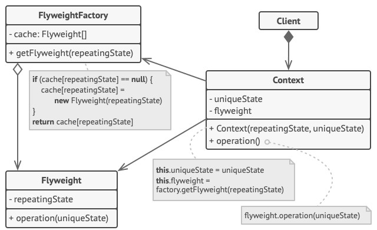

# Flyweight - Легковес, Приспособленец
* Экономит память, разделяя общее состояние объектов между собой, вместо хранения одинаковых данных в каждом объекте.
* Позволяет использовать разделяемые объекты сразу в нескольких контекстах.

### Аналогия из реального мира
Серийные дома:
* неизменяемые данные (внутреннее состояние) - количество этажей и материал.
* изменяемые данные (внешнее состояние) - координаты дома на карте и цвет стен.

### Решаемые проблемы
* В приложении используется очень большое количество почти одинаковых объектов.
  * Все нужные объекты занимают слишком много оперативной памяти.
    * Приложение тормозит и вылетает.
* При этом можно вынести изменяемую часть объекта вовне.
  * Эта часть должна быть достаточно большой.

### Решение
* Провести разделение
  * неизменяемые данные объекта - внутреннее состояние.
  * изменяемые данные объекта - внешнее состояние.
* Не хранить в классе внешнее состояние, а передавать его через параметры.
  * Т.о., одни и те же объекты можно будет использовать в различных контекстах.
  * Понадобится гораздо меньше объектов, т.к. они будут отличаться только внутренним состоянием, у которого не так много вариаций.
  * Такие облегчённые объекты и называются легковесами.
* Легковесы не должны меняться, т.к. они используются в разных контекстах.
* Создать фабрику легковесов.
  * Можно создать фабричный метод, принимающий в параметрах всё внутреннее состояние нужного объекта.
    * Фабричный метод будет искать уже созданные легковесы с таким же внутренним состоянием.
      * Если легковес нашёлся, он же и возвращается.
      * Если легковес не нашёлся, создаётся новый.
  * Можно создать отдельный класс-фабрику.

### Диаграмма классов

1. `Flyweight`. Легковес содержит состояние, которое повторялось во множестве первоначальных объектов.  
Один и тот же легковес можно использовать в связке со множеством контекстов.  
Состояние, которое хранится здесь, называется внутренним, а то, которое он получает извне - внешним.
2. `Context`. Контекст содержит "внешнюю" часть состояния, уникальную для каждого объекта.  
Контекст связан с одним из объектов-легковесов, хранящих оставшееся состояние.
3. Поведение оригинального объекта чаще всего оставляют в Легковесе, передавая значения контекста через параметры методов.  
Тем не менее, поведение можно поместить и в контекст, используя легковес как объект данных.
4. `Client`. Клиент вычисляет или хранит контекст, то есть внешнее состояние легковесов.  
Для клиента легковесы выглядят как шаблонные объекты, которые можно настроить во время использования, передав контекст через параметры.
5. `FlyweightFactory`. Фабрика легковесов управляет созданием и повторным использованием легковесов.  
Фабрика получает запросы, в которых указано желаемое состояние легковеса.  
Если легковес с таким состоянием уже создан, фабрика сразу его возвращает, а если нет - создаёт новый объект.

### Недостатки
* Расходует процессорное время на поиск/вычисление контекста.
* Отдельные экземпляры класса уже не смогут обладать собственным поведением, независимым от других экземпляров.
* Усложняет код из-за введения множества дополнительных классов.

### Примеры использования
* Работа с элементами UI.
* Работа с объектами карты.
* Повторяющиеся графические объекты в играх.

### Легковес VS Одиночка
| Легковес                                    | Одиночка                                      |
|---------------------------------------------|-----------------------------------------------|
| Может быть несколько объектов-легковесов    | Как правило, только один объект               |
| Объекты-легковесы должны быть неизменяемыми | Объект-одиночка допускает изменение поведения |
