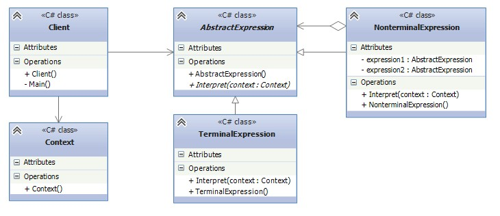

# Interpreter - Интерпретатор
* Определяет представление грамматики для заданного языка и интерпретатор предложений этого языка.

### Решаемые проблемы
* Некоторая задача встречается часто и имеет смысл представить её конкретные проявления в виде предложений на простом языке.
  * После этого можно создать интерпретатор, который решает задачу, анализируя предложения этого языка.
    * Н-р, поиск строк по образцу.
* Когда имеется интерпретируемый язык, конструкции которого можно представить в виде абстрактных синтаксических деревьев в случаях, когда:
  1. Грамматика проста.
     * Для сложных грамматик иерархия классов становится слишком громоздкой и неуправляемой.
  2. Эффективность не является главным критерием.
     * Наиболее эффективные интерпретаторы обычно не работают непосредственно с деревьями, а сначала транслируют их в другую форму, н-р, в конечный автомат.
     * Однако сам транслятор можно реализовать с помощью паттерна Интерпретатор.

### Решение
* Используются понятия терминальные и нетерминальные выражения:
  * Терминальные выражения - символы грамматики:
    * Н-р, переменные `x`, `y` и `z`.
  * Нетерминальные выражения - правила грамматики:
    * Н-р, операции `+` и `-`.
* Для каждого символа и каждого правила грамматики создаются отдельные классы.
* В терминальных узлах обычно не хранится информация о положении в абстрактном синтаксическом дереве.
  * Необходимый для интерпретации контекст предоставляют им родительские узлы.
* Интерпретация языка осуществляется вызовом метода `Interpret()` для каждого типа выражения.
  * Метод `Interpret()` в нетерминальных выражениях позволяет реализовать правила грамматики.
  * При этом можно добавлять новые правила грамматики, определив новые объекты нетерминальных выражений со своей реализацией метода `Interpret()`.
  * Метод получает контекст, содержащий входной поток разбираемой программы, идентифицирует входные данные и обрабатывает их.
* Паттерн Интерпретатор не поясняет, как создать абстрактное синтаксическое дерево, т.е. разбор выражения не входит в его задачу.
* Преимущества:
  * Представление правил грамматики в виде классов упрощает реализацию языка.
  * Т.к. грамматика представлена классами, можно легко изменять и расширять язык (поддержка OCP).
  * Включение дополнительных методов в структуру классов позволяет добавить новое поведение, не связанное с интерпретацией.
    * Н-р, форматированный вывод или проверку корректности выражения интерпретируемого языка.

### Диаграмма классов

1. `AbstractExpression`. Абстрактное выражение определяет интерфейс выражения, объявляет метод `Interpret()`.
2. `TerminalExpression`. Терминальное выражение представляет символ грамматики.  
Для каждого символа грамматики создаётся свой объект `TerminalExpression`.
3. `NonterminalExpression`. Нетерминальное выражение представляет правило грамматики.  
Для каждого правила грамматики создаётся свой объект `NonterminalExpression`.
4. `Context`. Контекст содержит общую для интерпретатора информацию.  
Может использоваться объектами терминальных и нетерминальных выражений для сохранения состояния операций и последующего доступа к сохранённому состоянию.
5. `Client`. Клиент строит предложения языка с данной грамматикой в виде абстрактного синтаксического дерева, узлами которого являются объекты `TerminalExpression` и `NonterminalExpression`.

### Недостатки
* Подходит только для языков с простой грамматикой, когда простота важнее эффективности.
* При большом количестве грамматических правил реализация становится громоздкой и неуправляемой.
  * В таких случаях лучше воспользоваться парсером/компилятором.

### Примеры использования
* Создание языковых интерпретаторов.
  * В частности, для языков и нотаций, специфичных для предметной области.
* Расчёт математических и булевых выражений.
* Поиск строк по образцу с использованием регулярных выражений.
* Интерпретация исходного кода программы в байт-код.
* Перевод с одного естественного языка на другой.
* Если рассматривать интерпретатор в самом общем виде (т.е. как операцию, распределённую по иерархии классов, основанной на паттерне [Компоновщик](../Composite/Composite.md)), то почти любое применение компоновщика содержит и интерпретатор.
  * Но паттерн Интерпретатор лучше применять в тех случаях, когда иерархию классов можно рассматривать как описание языка.

### Отношения с другими паттернами
* Абстрактное синтаксическое дерево - пример применения паттерна [Компоновщик](../Composite/Composite.md).
* [Приспособленец](../Flyweight/Flyweight.md) показывает варианты разделения терминальных символов в абстрактном синтаксическом дереве.
* Интерпретатор может пользоваться [Итератором](../Iterator/Iterator.md) для обхода структуры.
* [Посетитель](../Visitor/Visitor.md) может использоваться для инкапсуляции в одном классе поведения каждого узла абстрактного синтаксического дерева.
