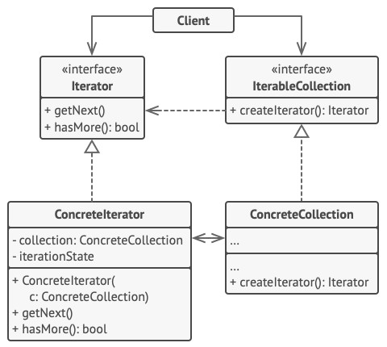

# Iterator (Cursor) - Итератор (Курсор)
* Позволяет последовательно обходить элементы составных объектов, не раскрывая их внутреннего представления.

### Аналогия из реального мира
Обход города для осмотра достопримечательностей.  
Есть разные способы обхода:
* Пешком - долго, но дёшево.
* Используя виртуальный гид - быстрее, но может быть не так дёшево.
* С помощью гида - ещё быстрее, но уже не дёшево.  
С помощью гида можно посетить те места, которые есть риск пропустить при обходе пешком.

В данном случае:
* Город - это коллекция достопримечательностей.
* Турист, виртуальный или реальный гид - это итератор коллекции.

### Решаемые проблемы
* Когда есть сложная структура данных и нужно скрыть от клиента детали её реализации.
  * Итератор предоставляет клиенту простые методы перебора коллекции.
    * Это упрощает доступ к коллекции и защищает её данные от неосторожных и злоумышленных действий.
* Когда нужно иметь несколько вариантов обхода одной и той же структуры данных и иметь возможность использовать их одновременно.
  * Код обхода может быть сложным и может захламлять собой сам класс коллекции или бизнес-логику.
  * Итератор выносит код обхода структуры данных в собственный класс, упрощая поддержку остального кода.
* Когда нужен единый интерфейс обхода различных структур данных.
  * Итератор выносит реализации различных вариантов обхода в подклассы.
    * Это позволяет взаимозаменять объекты итераторов в зависимости от того, с какой структурой данных предстоит работать.

### Решение
* Вводится класс Итератор.
  * Итератор отслеживает текущую позицию в коллекции и определяет, остались ли элементы для продолжения обхода.
* Одну коллекцию может обходить сразу несколько итераторов.
* Итератор может обходить коллекцию не только в прямом, но и обратном направлении.
* Для создания нового способа обхода нужно добавить новый класс.
* Итератор может быть внешним или внутренним.
  * Внешний итератор (pull-based, классический) отдаёт управление перебором элементов клиенту - тот вызывает метод `next()` для перехода к следующему элементу.
  * Внутренний итератор (push-based) сам перебирает элементы и выполняет над ними операцию, которую передаст клиент.
  * Внутренние итераторы проще в использовании, но менее гибкие.

### Диаграмма классов

1. `Iterator`. Итератор описывает интерфейс для доступа и обхода элементов коллекции.  
Обязательный минимум - операция получения следующего элемента коллекции.
2. `ConcreteIterator`. Конкретный итератор реализует алгоритм обхода какой-то конкретной коллекции.  
Объект итератора должен сам отслеживать текущую позицию при обходе коллекции, чтобы отдельные итераторы могли обходить одну и ту же коллекцию независимо.
3. `IterableCollection`. Коллекция описывает интерфейс получения итератора из коллекции.  
Коллекции могут быть разных типов, поэтому сама коллекция может создавать итераторы, так как она знает, какие именно итераторы способны с ней работать.  
Метод `CreateIterator()` является примером использования паттерна [Фабричный метод](../FactoryMethod/FactoryMethod.md).
4. `ConcreteCollection`. Конкретная коллекция возвращает новый экземпляр определённого конкретного итератора, связав его с текущим объектом коллекции.  
Сигнатура метода возвращает интерфейс итератора.  
Это позволяет клиенту не зависеть от конкретных классов итераторов.
5. `Client`. Клиент работает со всеми объектами через интерфейсы коллекции и итератора.  
Так клиентский код не зависит от конкретных классов, что позволяет применять различные итераторы, не изменяя существующий код программы.  
В общем случае клиенты не создают объекты итераторов, а получают их из коллекций.  
Тем не менее, если клиенту требуется специальный итератор, он всегда может создать его самостоятельно.

### Недостатки
* В простых случаях, когда можно обойтись обычным циклом, использование паттерна Итератор не оправдано.
* Итератор может быть неустойчив к изменениям коллекции.
  * Если коллекция изменяется во время обхода, то итератор может пропустить некоторые элементы или обойти один и тот же элемент несколько раз.
  * Варианты решения проблемы
    * Создать копию коллекции и обходить её.
    * Создать устойчивый итератор, который будет корректировать состояние обхода при каждом изменении коллекции.

### Примеры использования
* Обход коллекций различных типов:
  * Массив.
  * Список.
  * Дерево.
  * Граф.
  * Дерево паттерна [Компоновщик](../Composite/Composite.md).
* Обход базы данных.
* Обход удалённого API.
* Обход файлов, н-р, CSV и XML.
* Обход не всех элементов, а только удовлетворяющих некоторому условию.
  * Сотрудники, находящиеся в отпуске.
  * Товары, которые есть в наличии.

### Примеры в .NET
* `IEnumerable`/`IEnumerator` и `IEnumerable<T>`/`IEnumerator<T>` - позволяют обходить коллекции с помощью цикла `foreach`.
  * Интерфейс `IEnumerator` определяет функционал для перебора внутренних объектов в контейнере.
```csharp
public interface IEnumerator
{
    bool MoveNext(); // перемещение на одну позицию вперед в контейнере элементов
    object Current { get; }  // текущий элемент в контейнере
    void Reset(); // перемещение в начало контейнера
}
```
  * Интерфейс `IEnumerable` использует `IEnumerator` для получения итератора для конкретного типа объекта
```csharp
public interface IEnumerable
{
    IEnumerator GetEnumerator();
}
```
* `IObservable<T>`/`IObserver<T>` - для работы с реактивными (или push-based) коллекциями.

### Отношения с другими паттернами

