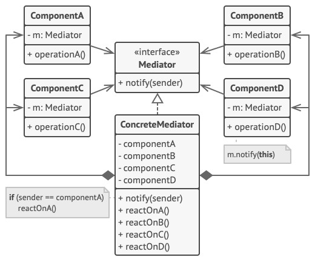

# Mediator (Controller) - Посредник
* Позволяет уменьшить связанность множества классов между собой, благодаря перемещению этих связей в один класс-посредник.
  * Т.е. вместо связи "все со всеми" будет связь "один со всеми".

### Аналогия из реального мира
Пилоты самолётов общаются не друг с другом, а с диспетчером.  
Диспетчер координирует действия нескольких самолётов одновременно.  
Без диспетчера пилотам приходилось бы следить за всеми окружающими самолётами самостоятельно.  
При этом диспетчер не нужен во время всего полёта.  
Он задействован только в зоне аэропорта, когда нужно координировать взаимодействие многих самолётов.

### Решаемые проблемы
* Сложно менять некоторые классы из-за того, что они имеют множество связей с другими классами.
  * Посредник позволяет поместить все эти связи в один класс, после чего будет легче их отрефакторить, сделать более понятными и гибкими.
* Сложно повторно использовать класс, т.к. он зависит от многих других классов.
  * При использовании посредника компоненты теряют прежние связи с другими компонентами, а всё их общение происходит косвенно, через объект-посредник.
* Когда приходится создавать множество подклассов компонентов, чтобы переиспользовать компоненты в разных контекстах.
  * Если раньше изменение отношений в одном компоненте могли повлечь за собой лавину изменений во всех остальных компонентах, то теперь достаточно будет создать подкласс посредника и поменять в нём связи между компонентами.

### Решение
* Создаётся объект-посредник, который знает, кому нужно перенаправить тот или иной запрос.
  * Теперь компоненты системы будут зависеть только от посредника, а не от кучи других компонентов.
* Компоненты должны общаться только через посредника, они не должны общаться друг с другом напрямую.
  * Если в компоненте происходит важное событие, он должен оповестить своего посредника, а тот сам решит - касается ли событие других компонентов, и стоит ли их оповещать.
  * При этом компонент-отправитель не знает, кто обработает его запрос, а компонент-получатель не знает, кто его прислал.
* Можно выделить общий интерфейс для посредников, что позволит использовать компоненты и с другими посредниками.
* Таким образом, посредник скрывает в себе все сложные связи между классами.
  * Чем меньше связей имеют классы, тем проще их изменять, расширять и повторно использовать.

### Диаграмма классов

1. `Components`. Компоненты (Коллеги) - это разнородные объекты, содержащие бизнес-логику программы.  
Каждый компонент хранит ссылку на объект посредника, но работает с ним только через абстрактный интерфейс посредников (`Mediator`).  
Благодаря этому, компоненты можно повторно использовать в другой программе, связав их с посредником другого типа.
2. `Mediator`. Посредник определяет интерфейс для обмена информацией с компонентами.  
Обычно хватает одного метода, чтобы оповещать посредника о событиях, произошедших в компонентах.  
В параметрах этого метода можно передавать детали события: ссылку на компонент, в котором оно произошло, и любые другие данные.
3. `ConcreteMediator`. Конкретный посредник содержит код взаимодействия нескольких компонентов между собой.  
Зачастую этот объект не только хранит ссылки на все свои компоненты, но и сам их создаёт, управляя дальнейшим жизненным циклом.

### Недостатки
* Посредник может сильно раздуться, стать слишком большим и сложным в сопровождении классом.
* Посредник усложняет код тем, что он не устраняет связи между компонентами, а лишь делает их неявными.
  * Использовать Посредник стоит лишь тогда, когда станет понятно, в чём конкретно заключается его задача (общая задача - инкапсуляция взаимодействия объектов).

### Примеры использования
* Объединение нескольких автономных классов.
  * Связь нескольких компонентов GUI.
  * Уведомление пользователей о произошедшем событии, н-р, выполнилась тяжеловесная операция.
* Устранение циклических зависимостей.

### Примеры в .NET
* Windows Forms - форма выступает в роли посредника: следит за событиями компонентов формы и передаёт управление другим компонентам и бизнес-объектам.
* Класс `EventAggregator`, активно используемый в WPF и за его пределами, является примером глобального посредника для связи разных независимых компонентов между собой.
* В паттернах MVC и MVP Controller и Presenter выступают в роли посредника между представлением и моделью.

### Посредник VS Наблюдатель
Общее: организуют работу отправителей запросов с их получателями.

| Посредник                                                                                                 | Наблюдатель                                                                                                                     |
|-----------------------------------------------------------------------------------------------------------|---------------------------------------------------------------------------------------------------------------------------------|
| **Цель**: Убрать обоюдные зависимости между компонентами системы, они будут зависеть от самого посредника | **Цель**: Обеспечить динамическую одностороннюю связь, в которой одни объекты косвенно зависят от других                        |
| Посредник сам определяет, какому компоненту передать запрос                                               | Субъект передаёт запрос одновременно всем получателям, но позволяет им динамически подписываться или отписываться от оповещений |
| Посредник знает, какие он связывает компоненты                                                            | Субъект ничего не знает про своих наблюдателей                                                                                  |
| Компонент не знает, кто инициировал событие                                                               | Наблюдатель знает, кто инициировал событие                                                                                      |

### Посредник VS Фасад
Общее: организуют работу множества существующих классов.

| Посредник                                                                                 | Фасад                                                                                   |
|-------------------------------------------------------------------------------------------|-----------------------------------------------------------------------------------------|
| **Цель**: Централизовать общение между компонентами системы                               | **Цель**: Создать упрощённый интерфейс к подсистеме, не внося новой функциональности    |
| Компоненты знают о существовании Посредника                                               | Подсистема не знает о существовании Фасада                                              |
| У компонентов нет прямого доступа к другим компонентам                                    | Классы подсистемы общаются друг с другом напрямую                                       |
| Двунаправленный протокол - Посредник может и отправлять и получать запросы от компонентов | Однонаправленный протокол - Фасад отправляет запросы классам подсистемы, но не наоборот |
