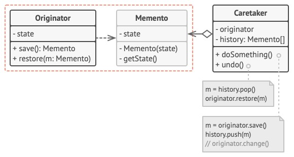
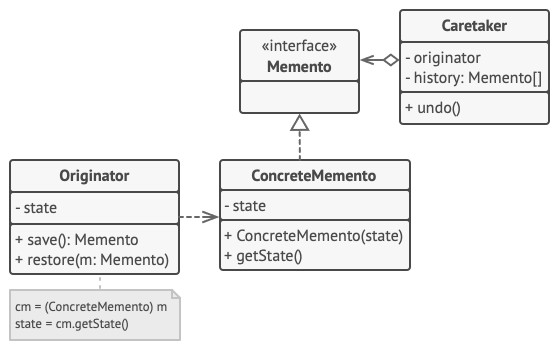
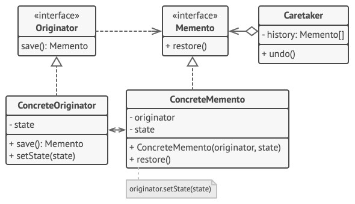

# Memento - Снимок (Хранитель)
* Позволяет сохранять и восстанавливать прошлые состояния объектов, не раскрывая подробностей их реализации.
* Позволяет выносить внутреннее состояние объекта за его пределы для последующего возможного восстановления объекта без нарушения принципа инкапсуляции.

### Наглядный пример
Редактирование документа.  
В процессе редактирования сохраняются снимки некоторых состояний документа.  
Это даёт возможность откатывать изменения и, при необходимости, накатывать их обратно.

### Решаемые проблемы
* Когда нужно сохранять снимки состояния объекта или его части, чтобы потом можно было восстановить объект в том же состоянии.
  * С помощью паттерна Снимок можно создавать любое количество снимков объекта и хранить их независимо от этого объекта.
* Когда прямое получение состояния объекта раскрывает приватные детали его реализации, нарушая инкапсуляцию.
  * Паттерн предлагает создавать снимки самому объекту, т.к. ему доступны все поля, в т.ч. приватные.

### Решение
* Паттерн Снимок поручает создание копии состояния объекта самому объекту, который этим состоянием владеет.
* Копия будет храниться в специальном объекте-снимке с ограниченным интерфейсом.
  * Интерфейс будет позволять, например, узнать дату создания или название снимка.
* Снимок должен быть открыт для своего создателя, позволяя прочесть и восстановить его внутреннее состояние.
* Объекты, хранящие снимки, называются опекуны.
  * Опекунам будет доступен только ограниченный интерфейс снимка, поэтому они не смогут изменить его внутреннее состояние.
  * Опекун может попросить создателя восстановить своё состояние, передав ему соответствующий снимок.

### Диаграмма классов - Классическая реализация на вложенных классах
Для языков, которые поддерживают механизм вложенных классов.

1. `Originator`. Создатель может производить снимки своего состояния, а также воспроизводить прошлое состояние, если подать в него готовый снимок.
2. `Memento`. Снимок - это простой объект данных, содержащий состояние создателя.  
Надёжнее всего сделать объекты снимков неизменяемыми, передавая в них состояние только через конструктор.
3. `Caretaker`. Опекун должен знать, когда делать снимок создателя и когда его нужно восстанавливать.  
Опекун может хранить историю прошлых состояний создателя в виде стека из снимков.  
Когда понадобится отменить выполненную операцию, он возьмёт "верхний" снимок из стека и передаст его создателю для восстановления.
4. В данной реализации снимок (`Memento`) - это внутренний класс по отношению к классу создателя (`Originator`).  
Именно поэтому он имеет полный доступ к полям и методам создателя, даже приватным.  
С другой стороны, опекун не имеет доступа ни к состоянию, ни к методам снимков и может всего лишь хранить ссылки на эти объекты.

### Диаграмма классов - Реализация с пустым промежуточным интерфейсом
Для языков, которые не поддерживают механизм вложенных классов.

1. В этой реализации создатель работает напрямую с конкретным классом снимка, а опекун - только с его ограниченным интерфейсом.
2. Благодаря этому достигается тот же эффект, что и в классической реализации.  
Создатель имеет полный доступ к снимку, а опекун — нет.

### Диаграмма классов -  Снимки с повышенной защитой
Когда нужно полностью исключить возможность доступа к состоянию создателей и снимков.

1. Эта реализация разрешает иметь несколько видов создателей и снимков.  
Каждому классу создателей соответствует свой класс снимков.  
Ни создатели, ни снимки не позволяют другим объектам прочесть своё состояние.
2. Здесь опекун ещё более жёстко ограничен в доступе к состоянию создателей и снимков.  
Но, с другой стороны, опекун становится независим от создателей, поскольку метод восстановления теперь находится в самих снимках.
3. Снимки теперь связаны с теми создателями, из которых они сделаны.  
Они по-прежнему получают состояние через конструктор.  
Благодаря близкой связи между классами, снимки знают, как восстановить состояние своих создателей.

### Недостатки
* Потребуется много памяти, если снимки будут делаться часто и/или храниться долго.
* Сохранение и восстановление состояния может быть довольно продолжительной операцией.
  * Если такие операции требуется выполнять достаточно часто, то паттерн Снимок может не подойти.
* В некоторых языках (PHP, Python, JavaScript) сложно гарантировать, чтобы только исходный объект имел доступ к состоянию снимка.

### Примеры использования
* Хранение истории операций для возможности реализовать операции "отменить/повторить" при создании
  * текстовых документов;
  * изображений;
  * калькуляторов.
* При использовании механизма транзакций можно хранить в снимке исходное состояние, чтобы восстановиться в случае ошибки.

### Отношения с другими паттернами
* Снимок можно использовать вместе с [Итератором](../Iterator/Iterator.md), чтобы сохранить текущее состояние обхода структуры данных и вернуться к нему в будущем, если потребуется.
* [Команду](../Command/Command.md) и Снимок можно использовать сообща для реализации отмены операций.
  * В этом случае объекты команд будут отвечать за выполнение действия над объектом, а снимки будут хранить резервную копию состояния этого объекта, сделанную перед самым запуском команды.
* Снимок можно использовать вместе с [Итератором](../Iterator/Iterator.md), чтобы сохранить текущее состояние обхода структуры данных и вернуться к нему в будущем, если потребуется.
* Снимок иногда можно заменить [Прототипом](../Prototype/Prototype.md), если объект, состояние которого требуется сохранять в истории, довольно простой, не имеет активных ссылок на внешние ресурсы либо их можно легко восстановить.
