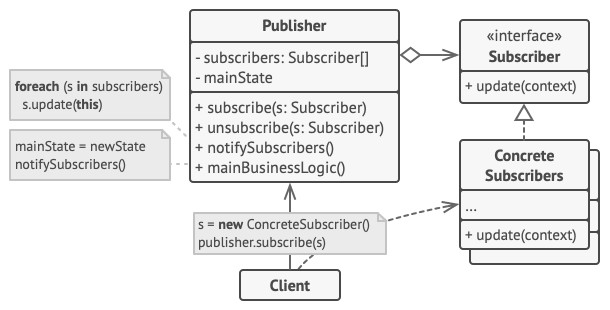

# Observer - Наблюдатель (Слушатель, Издатель-подписчик)
* Создаёт механизм подписки, позволяющий одним объектам следить и реагировать на события, происходящие в других объектах.
* Определяет отношение "один-ко-многим" между объектами таком образом, что при изменении состояния одного объекта происходит автоматическое оповещение и обновление всех зависимых объектов.

### Аналогия из реального мира
1. Пример с поступлением товара в магазин.  
Покупатель ждёт товар, который вот-вот должны завезти в магазин. Варианты действия:
   * Покупатель может каждый день ходить в магазин и спрашивать о товаре.  
   Тогда он будет тратить много своего времени.  
   * Магазин может рассылать всем клиентам информацию о всех поступающих товарах.  
   Тогда многие клиенты будут получать ненужные им сообщения, а магазин будет тратить ресурсы на их рассылку.
   * Магазин хранит у себя информацию о том, какой товар нужен покупателю, и уведомит его, когда завезут товар.
2. Подписка на газеты.  
Клиент подписывается на определённую газету, а когда выходит новый номер, издательство присылает его клиенту на дом по почте.  
Клиент может в любой момент отписаться от рассылки и перестать получать газеты.

### Решаемые проблемы
* Необходимо поддерживать объекты разных классов в согласованном состоянии.
* Когда есть объект, генерирующий сообщения, и множество объектов (подписчиков), которые должны реагировать на эти сообщения.
  * Точное число подписчиков заранее неизвестно.
  * Состав подписчиков может изменяться в процессе работы.
  * Объекты, обрабатывающие сообщения, могут находиться выше по иерархии системы, чем объект, генерирующий сообщения.

### Решение
* Разделить функциональность на издателей и подписчиков.
  * Издатель (субъект) - объект, который содержит состояние, важное для других объектов.
  * Подписчик (наблюдатель) - объект, который хочет отслеживать изменение этого состояния.
* Издатель хранит список ссылок на объекты подписчиков.
  * Издатель не должен вести список подписчиков самостоятельно.  
  Он предоставляет методы, с помощью которых подписчики добавляют или убирают себя из списка.
* Когда в издателе происходит определённое событие, он пробегается по списку подписчиков и оповещает их, вызывая определённый метод объектов-подписчиков.
* Издателю не важен конкретный класс подписчиков, т.к. они следуют общему интерфейсу (поддержка OCP).
* Наблюдатель может и сам являться издателем.
* Наблюдатель может быть подписан на несколько субъектов.
  * В таком случае различать, в каком именно субъекте произошло событие, можно через параметры метода `update()`.

### Модели взаимодействия push и pull

| Push модель                                                                                        | Pull модель                                                                                                                         |
|----------------------------------------------------------------------------------------------------|-------------------------------------------------------------------------------------------------------------------------------------|
| Наблюдаемый объект выталкивает наблюдателям необходимые данные                                     | Наблюдатели самостоятельно вытягивают данные из наблюдаемого объекта                                                                |
| Проще, т.к. вся нужная информация передаётся через аргументы                                       | Гибче, т.к. наблюдатели могут сами решать, какие данные им нужны                                                                    |
| Полезна, н-р, для работы с бизнес-логикой, т.к. простота решения в данном случае полезнее гибкости | Полезна, н-р, для работы с GUI, когда UI-компонент не знает, что пользователю может понадобится для обработки определённого события |

### Диаграмма классов

1. `Publisher`. Издатель владеет внутренним состоянием `mainState`, изменение которого интересно отслеживать подписчикам.  
Издатель содержит механизм подписки: список подписчиков и методы подписки/отписки.
2. Когда внутреннее состояние издателя меняется, он оповещает своих подписчиков.  
Для этого издатель проходит по списку подписчиков и вызывает их метод оповещения, заданный в общем интерфейсе подписчиков.
3. `Subscriber`. Подписчик определяет интерфейс, которым пользуется издатель для отправки оповещения.  
В большинстве случаев для этого достаточно единственного метода.
4. `ConcreteSubscribers`. Конкретные подписчики выполняют что-то в ответ на оповещение, пришедшее от издателя.  
Эти классы должны следовать общему интерфейсу подписчиков, чтобы издатель не зависел от конкретных классов подписчиков.
5. По приходу оповещения подписчику нужно получить обновлённое состояние издателя.  
Издатель может передать это состояние через параметры метода оповещения.  
Более гибкий вариант — передавать через параметры весь объект издателя, чтобы подписчик мог сам получить требуемые данные.  
Как вариант, подписчик может постоянно хранить ссылку на объект издателя, переданный ему в конструкторе.
6. `Client`. Клиент создаёт объекты издателей и подписчиков, а затем регистрирует подписчиков на обновления в издателях.

### Недостатки
* Подписчики оповещаются в случайном порядке.
  * Работа кода не должна зависеть от порядка оповещения наблюдателей.
* Подписчики могут получать слишком много оповещений, если состояние издателя часто меняется.
* Подписчикам могут быть нужны не все получаемые оповещения.
* Возможны утечки памяти.
  * Поскольку наблюдаемый объект содержит неявную ссылку на все наблюдатели, то, пока он жив, будут жить и они.
  * Способы решения проблемы:
    1. Избегать долгоживущих объектов вообще, а долгоживущих объектов с событиями - в особенности (в частности, Singleton).
    2. Наблюдатели могут реализовать интерфейс `IDisposable` и отписываться от событий в методе `Dispose`.
    3. Можно воспользоваться слабыми событиями (Weak Event Pattern).  
    Специальной реализацией событий, в которой используются слабые ссылки (Weak References) для управления наблюдателями.  
    В этом случае слабое событие не будет являться корневой ссылкой и не станет препятствовать сборке мусора, когда на наблюдатель не останется других ссылок.

### Примеры использования
Когда после изменения состояния в одном объекте необходимо что-то сделать в других объектах, при этом список этих объектов заранее неизвестен и может меняться со временем.
* Уведомление пользователей, н-р
  * когда были обновлены некоторые данные в БД.
  * когда была выполнена какая-то тяжеловесная операция.
* Задачи, выполняемые по расписанию, н-р
  * загрузка данных в БД из внешних источников.
  * долгие расчёты.
* Обработка событий в GUI.
* Получение сообщения из внешней системы, н-р, из очереди сообщений.
* Семейство паттернов MVx (Model - View - Controller/Presenter/ViewModel) освобождает модель от необходимости представления именно с помощью наблюдателей.

### Примеры в .NET
* Большое количество наблюдателей в форме событий.
* Наблюдатели в форме делегатов часто используются
  * в качестве методов обратного вызова для выполнения дополнительной инициализации - `AppDomainSetup.AppDomainInitializer`, `HttpConfiguration.Initializer`.
  * в качестве точек расширения - фильтры и селекторы в WPF/Windows Forms/WCF.
* Наблюдатели в форме интерфейсов.
  * API для работы с Event Hub - масштабируемой системой обмена сообщениями.
  * Интерфейс `IEventProcessor` содержит методы `CloseAsync`, `OpenAsync` и `ProcessEventsAsync`.

### Наблюдатель VS Посредник
Общее: организуют работу отправителей запросов с их получателями.

| Наблюдатель                                                                                                                     | Посредник                                                                                                 |
|---------------------------------------------------------------------------------------------------------------------------------|-----------------------------------------------------------------------------------------------------------|
| **Цель**: Обеспечить динамическую одностороннюю связь, в которой одни объекты косвенно зависят от других                        | **Цель**: Убрать обоюдные зависимости между компонентами системы, они будут зависеть от самого посредника |
| Субъект передаёт запрос одновременно всем получателям, но позволяет им динамически подписываться или отписываться от оповещений | Посредник сам определяет, какому компоненту передать запрос                                               |
| Субъект ничего не знает про своих наблюдателей                                                                                  | Посредник знает, какие он связывает компоненты                                                            |
| Наблюдатель знает, кто инициировал событие                                                                                      | Компонент не знает, кто инициировал событие                                                               |
