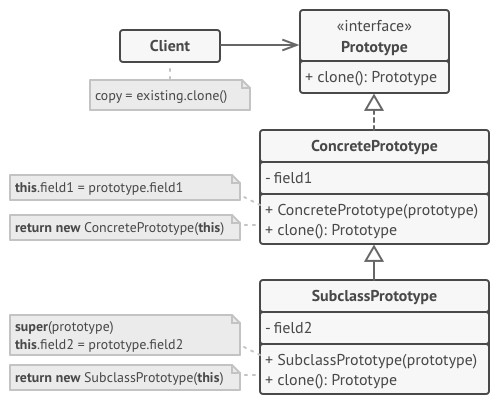
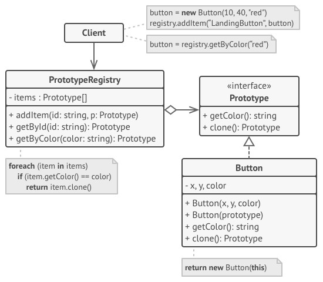

# Prototype - Прототип
* Позволяет копировать объекты, не вдаваясь в подробности их реализации

### Аналогия из реального мира
Деление клеток.  
В результате деления образуются две совершенно идентичные клетки.  
Оригинальная клетка отыгрывает роль прототипа, принимая активное участие в создании нового объекта.

### Решаемые проблемы
* Необходимость скопировать значения приватных полей объекта.
* Копирующий код впадает в зависимость от классов копируемых объектов – недостаточно знать только интерфейс.
* Точный тип копируемого объекта неизвестен.
* Много повторяющегося кода при инициализации объектов.
* Когда нежелательно создание отдельной иерархии классов фабрик для создания объектов из параллельной иерархии классов.

### Решение
* Объекты копируют сами себя.
* Вводится общий интерфейс с методом `Clone` для объектов, поддерживающих клонирование – нет привязки к конкретным классам.
* Класс реализует метод `Clone`: он создаёт новый экземпляр текущего класса и копирует в него все значения из полей копируемого объекта.
* Прототипом называется объект, который копируют.
* Копируемые объекты сами решают, как клонировать связанные объекты и рекурсивные зависимости.
* Паттерн Прототип позволяет копировать набор объектов не зная их конкретных типов.

### Диаграмма классов. Базовая реализация

1. `Prototype`. Интерфейс прототипов описывает операции клонирования.  
В большинстве случаев — это единственный метод `clone`.
2. `ConcretePrototype`. Конкретный прототип реализует операцию клонирования самого себя.  
Помимо банального копирования значений всех полей, здесь могут быть спрятаны различные сложности, о которых не нужно знать клиенту.  
Например, клонирование связанных объектов, распутывание рекурсивных зависимостей и прочее.
3. `Client`. Клиент создаёт копию объекта, обращаясь к нему через общий интерфейс прототипов.

### Диаграмма классов. Реализация с общим хранилищем прототипов

1. `PrototypeRegistry`. Хранилище прототипов облегчает доступ к часто используемым прототипам, храня набор предварительно созданных эталонных, готовых к копированию объектов.  
Простейшее хранилище может быть построено с помощью хеш-таблицы вида имя-прототипа → прототип.  
Но для удобства поиска прототипы можно маркировать и другими критериями, а не только условным именем.

### Недостатки
* Не получится добавить метод `Clone` во внешние классы.
* Сложности в клонировании объектов, ссылающихся на другие объекты.

### Примеры использования
1. Некоторые классы, реализующие `ICloneable`:
   * `Array`
   * `Hashtable`
   * `String`
   * `Delegate`
2. Наличие небольшого количества слабо отличающихся друг от друга объектов.
