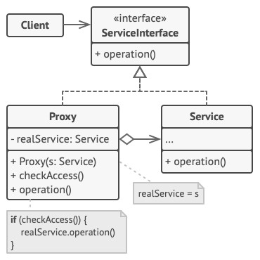

# Proxy - Заместитель
* Позволяет подставлять специальные объекты-заменители вместо реальных объектов.
* Эти объекты перехватывают вызовы к оригинальному объекту, позволяя сделать что-то до или после передачи вызова оригиналу.
* Другими словами, Заместитель предоставляет суррогатный объект, управляющий доступом к другому объекту.

### Аналогия из реального мира
Платёжная карточка - заместитель наличных денег.
* И карточка, и наличные имеют общий интерфейс - ими можно оплачивать товары.
* Для покупателя польза в том, что не надо таскать с собой тонны наличных.
* Владелец магазина рад, что ему не нужно делать дорогостоящую инкассацию наличности в банк - деньги поступают к нему на счёт напрямую.

### Решаемые проблемы
* Необходимость в контроле доступа к ресурсоёмким или критичным объектам, н-р, к БД или файлам.
* Когда необходима возможность отложить создание объекта до момента, когда возникнет фактическая необходимость в нём.
* Необходимость в логировании запросов к объекту.
* Необходимость в кэшировании результатов операций объекта.

### Решение
* Создаётся класс-дублёр, имеющий тот же интерфейс, что и оригинальный служебный объект.
* При получении запроса от клиента объект-заместитель сам создаёт экземпляр служебного объекта и переадресовывает ему всю реальную работу.
* Т.о. вводится дополнительный уровень косвенности.
* Заместитель может не знать конкретный тип реального объекта, а работать с ним через интерфейс.
  * Тогда один заместитель сможет работать с несколькими классами единообразно.
  * Вариант не подойдёт, если заместитель сам должен создавать экземпляры субъектов.

### Диаграмма классов

1. `ServiceInterface`. Интерфейс сервиса определяет общий интерфейс для сервиса и заместителя.  
Благодаря этому, объект заместителя можно использовать там, где ожидается объект сервиса.
2. `Service`. Сервис содержит полезную бизнес-логику.
3. `Proxy`. Заместитель хранит ссылку на объект сервиса.  
После того как заместитель заканчивает свою работу, он передаёт вызовы вложенному сервису.  
Заместитель может сам отвечать за создание и удаление объекта сервиса.
4. `Client`. Клиент работает с объектами через интерфейс сервиса.  
Благодаря этому, его можно "одурачить", подменив объект сервиса объектом заместителя.

### Недостатки
* Усложняет код введением дополнительных классов.
* Увеличивает время отклика от сервиса.

### Примеры использования
* Виртуальный прокси - обеспечение ленивой инициализации, тяжёлый объект создаётся только тогда, когда он действительно понадобится.
  * Пример - тяжёлый объект, грузящий данные из файловой системы или базы данных.
* Защищающий прокси - обеспечение защиты объекта от неавторизованного доступа.
  * Пример - защита частей ОС от сторонних программ.
* Удалённый прокси - локальное исполнение удалённого сервиса.
  * Когда настоящий сервисный объект находится на удалённом сервере.
  * В этом случае заместитель транслирует запросы клиента в вызовы по сети и берёт на себя сложности по работе с сетью.
* Логирующий прокси - логирование запросов к сервисному объекту, сохранение истории обращений.
* Кэширующий прокси - кэширование результатов запросов.
* Синхронизирующий прокси - предоставление безопасного доступа к объекту из нескольких потоков.
* "Умная" ссылка.
  * Когда нужно иметь возможность освободить тяжелый объект, которым уже никто не пользуется.
  * Заместитель может подсчитывать количество ссылок на сервисный объект, которые были отданы клиенту и остаются активными.  
  Когда все ссылки освобождаются, можно будет освободить и сам сервисный объект (например, закрыть подключение к базе данных).
  * Заместитель может отслеживать, не менял ли клиент сервисный объект.  
  Это позволит использовать объекты повторно и значительно экономить ресурсы, особенно для больших сервисов.

### Примеры в .NET
1. Удалённые заместители. В коммуникационных технологиях в .NET применяются удалённые прокси-классы:
   * `ChannelBase<T>` в WCF.
   * `RealProxy` в .NET Remoting.
2. Виртуальные заместители в ORM-фреймворках.  
В ORM, в частности, EntityFramework и NHibernate, применяются виртуальные прокси-классы.  
ORM генерирует оболочку над сущностями чтобы отслеживать изменения и генерировать SQL-код для обновления записей в БД.

### Отношения с другими паттернами
* [Адаптер](../Adapter/Adapter.md) предоставляет классу альтернативный интерфейс, [Декоратор](../Decorator/Decorator.md) предоставляет расширенный интерфейс, Заместитель предоставляет тот же интерфейс.
* [Фасад](../Facade/Facade.md) похож на Заместитель тем, что замещает сложную подсистему и может сам её инициализировать.
  * Но в отличие от Фасада, Заместитель имеет тот же интерфейс, что его служебный объект, благодаря чему их можно взаимозаменять.

#### Заместитель VS Декоратор
Общее: Заместитель и [Декоратор](../Decorator/Decorator.md)
* Построены на принципе композиции.
* Делегируют работу другим объектам.

| Заместитель                                         | Декоратор                                         |
|-----------------------------------------------------|---------------------------------------------------|
| **Цель**: управление доступом к объекту             | **Цель**: добавление нового поведения для объекта |
| Предоставляет классу тот же интерфейс               | Предоставляет классу расширенный интерфейс        |
| Заместитель сам управляет жизнью сервисного объекта | Обёртывание декораторами контролируется клиентом  |
