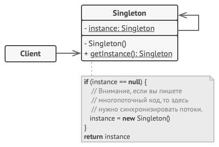

# Singleton - Одиночка
* Гарантирует, что у класса есть только один экземпляр, и предоставляет глобальную точку доступа к нему.
* Одиночка эмулирует глобальные переменные в объектно-ориентированных языках.

### Решаемые проблемы
* С помощью конструктора всегда создаётся новый экземпляр, а нужен созданный ранее.
* Глобальные переменные могут быть не защищены от записи - могут измениться в любом месте.
* Ненужная или преждевременная инициализация объекта.

### Решение
* Конструктор скрывается (private).
* Используется публичный статический метод, возвращающий один и тот же объект.

### Диаграмма классов

1. `Singleton`. Одиночка определяет статический метод `getInstance`, который возвращает единственный экземпляр своего класса.  
Конструктор одиночки должен быть скрыт от клиентов.  
Вызов метода `getInstance` должен стать единственным способом получить объект этого класса.

### Недостатки
* Нарушение SRP:
    * Управление своим экземпляром и предоставление доступа к нему.
    * Выполнение бизнес-логики.
* Маскирует плохой дизайн – могут появиться лишние зависимости.
* Могут быть проблемы в многопоточной среде.
* Требует создания мок-объектов при написании юнит-тестов.
* Трудноуловимые ошибки у синглтонов с изменчивым состоянием.

### Примеры использования
1. Работа с БД.
2. Кэширование.
3. Логирование.
4. Доступ к стабильной информации, например, параметрам конфигурации приложения.

### Примеры в .NET
* `Thread.CurrentThread`.
* `HttpContext.Current`.

### Singleton VS static class
| Singleton                                                                | static class                                                               |
|--------------------------------------------------------------------------|----------------------------------------------------------------------------|
| Более гибкий                                                             | Проще в использовании                                                      |
| Одна точка доступа - `GetInstance`                                       | Точек доступа по количеству публичных членов                               |
| Возможна сериализация                                                    | Невозможна сериализация                                                    |
| Может реализовать интерфейс                                              | Не может реализовать интерфейс                                             |
| Лучше подходит когда: * Нужно хранить состояние * Много операций | Лучше подходит когда: * Не нужно хранить состояние * Мало операций |

### Отношения с другими паттернами
* Можно воспользоваться паттерном Одиночка, чтобы гарантировать уникальность и глобальную доступность [наблюдаемого объекта](../Observer/Observer.md).
* [Фасад](../Facade/Facade.md) можно сделать Одиночкой, так как обычно нужен только один объект-фасад.
* [Абстрактная фабрика](../AbstractFactory/AbstractFactory.md), [Строитель](../Builder/Builder.md) и [Прототип](../Prototype/Prototype.md) могут быть реализованы при помощи Одиночки.

#### Одиночка VS Легковес
Общее: [Легковес](../Flyweight/Flyweight.md) может напоминать Одиночку, если для конкретной задачи получилось свести количество объектов к одному.

| Одиночка                                      | Легковес                                    |
|-----------------------------------------------|---------------------------------------------|
| Как правило, только один объект               | Может быть несколько объектов-легковесов    |
| Объект-одиночка допускает изменение поведения | Объекты-легковесы должны быть неизменяемыми |
