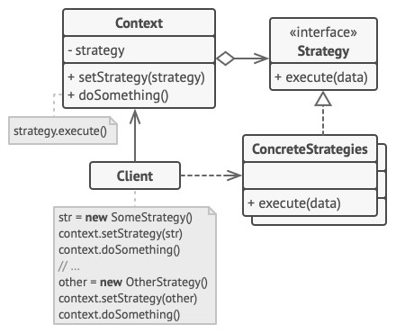

# Strategy - Стратегия
* Определяет семейство схожих алгоритмов и помещает каждый из них в собственный класс (стратегию).
* В результате можно:
  * Взаимозаменять алгоритмы во время выполнения программы.
  * Модифицировать алгоритмы независимо от их использования на стороне клиента.

### Аналогия из реального мира
* Нужно добраться из точки А в точку Б.
* Можно сделать это разными способами: на автобусе, на такси, на велосипеде.
* Вид транспорта является стратегией.
* Конкретная стратегия выбирается из контекста, н-р, в зависимости от имеющихся денег и времени.

### Решаемые проблемы
* Имеется множество схожих алгоритмов, тесно переплетённых в одном месте.
  * Сложно и багоопасно изменять имеющиеся алгоритмы и добавлять новые.
* Есть развесистый условный оператор, каждая ветвь которого представляет собой вариацию алгоритма.
* Нужно использовать разные вариации алгоритма внутри одного объекта.
  * Стратегия позволяет варьировать поведение объекта во время выполнения программы.
* Есть множество похожих классов, отличающихся только некоторым поведением.
  * Стратегия позволяет вынести отличающееся поведение в отдельную иерархию классов, а затем свести первоначальные классы к одному, сделав поведение этого класса настраиваемым.

### Решение
* Вынести алгоритмы в отдельные классы.
* Изначальный класс, вместо выполнения всех алгоритмов, будет играть роль контекста, делегируя стратегиям выполнение работы.
* Для замены алгоритма достаточно подставить в контекст другой объект-стратегию.
* У стратегий должен быть общий интерфейс. Благодаря этому:
  * Контекст не будет зависеть от конкретных классов стратегий.
  * Можно будет изменять и добавлять новые стратегии, не трогая код контекста (поддержка OCP).

### Диаграмма классов

1. `Context`. Контекст хранит ссылку на объект конкретной стратегии, работая с ним через общий интерфейс стратегий.
2. `Strategy`. Стратегия определяет интерфейс, общий для всех вариаций алгоритма.  
Контекст использует этот интерфейс для вызова алгоритма.  
Для контекста неважно, какая именно вариация алгоритма будет выбрана, так как все они имеют одинаковый интерфейс.
3. `ConcreteStrategies`. Конкретные стратегии реализуют различные вариации алгоритма.
4. Во время выполнения программы контекст получает вызовы от клиента и делегирует их объекту конкретной стратегии.
5. `Client`. Клиент должен создать объект конкретной стратегии и передать его в конструктор контекста.  
Кроме этого, клиент должен иметь возможность заменить стратегию на лету, используя сеттер.  
Благодаря этому, контекст не будет знать о том, какая именно стратегия сейчас выбрана.

### Недостатки
* Усложняет код за счёт введения дополнительных классов.
* Клиент должен знать, чем стратегии отличаются друг от друга, чтобы выбрать из них подходящую.
  * Следовательно, применять паттерн стоит тогда, когда различия в поведении должны быть важны для клиента.
* Паттерн не определяет, как стратегия получит данные для своей работы.
  * Данные могут передаваться через аргумент метода.
  * Стратегия может получить ссылку на контекст и запрашивать данные самостоятельно.
* Паттерн не определяет, каким образом контекст получает экземпляр стратегии.
  * В аргументах конструктора.
  * Через метод или свойство.

### Примеры использования
* Когда есть набор различных алгоритмов и требуется возможность их замены во время выполнения:
  * Сортировка списка объектов.
  * Чтение логов.
  * Валидация объектов.
  * Рассылка уведомлений по разным каналам.
  * Оплата различными способами.
  * Кодирование/декодирование.
  * Сериализация/десериализация.
* Стратегия - фундаментальный паттерн, проявляется в некоторых других паттернах:
  * [Абстрактная фабрика](../AbstractFactory/AbstractFactory.md) - это стратегия создания семейства объектов.
  * [Фабричный метод](../FactoryMethod/FactoryMethod.md) - это стратегия создания одного объекта.
  * [Строитель](../Builder/Builder.md) - это стратегия построения объекта.
  * [Итератор](../Iterator/Iterator.md) - это стратегия перебора элементов.
  * и др.

### Примеры в .NET
* `LINQ` - набор методов расширения, принимающих стратегии фильтрации, получения проекции и т.д.
* Любой класс, который принимает `IComparer<T>` или `IEqualityComparer<T>`.
  * Используя `IComparer<T>`, можно создать несколько алгоритмов сортировки (стратегий), которые не зависят друг от друга, и которые легко заменимы.

### Отношения с другими паттернами
* [Команда](../Command/Command.md) и Стратегия похожи по духу, но отличаются масштабом и применением:
  * Команду используют, чтобы превратить любые разнородные действия в объекты.
  * Параметры операции превращаются в поля объекта.
    * Этот объект теперь можно логировать, хранить в истории для отмены, передавать во внешние сервисы и так далее.
  * С другой стороны, Стратегия описывает разные способы произвести одно и то же действие, позволяя взаимозаменять эти способы в каком-то объекте контекста.
* Стратегия меняет поведение объекта "изнутри", а [Декоратор](../Decorator/Decorator.md) изменяет его "снаружи".

#### Стратегия VS Состояние
Общее: Стратегию и [Состояние](../State/State.md) используют композицию, чтобы менять поведение основного объекта, делегируя работу вложенным объектам-помощникам.

| Стратегия                                                  | Состояние                                                   |
|------------------------------------------------------------|-------------------------------------------------------------|
| **Цель**: Инкапсулировать алгоритм                         | **Цель**: Инкапсулировать поведение, зависящее от состояния |
| _Как объект выполняет определённую задачу?_                | _В каком состоянии находится объект?_                       |
| Стратегии, как правило, не знают о контексте               | Состояния хранят в себе ссылку на контекст                  |
| Стратегии не знают друг о друге                            | Состояния знают друг о друге и могут переключать сами себя  |
| Контекст получает объекты-стратегии извне, через параметры | Контекст сам создаёт объекты-состояния                      |

Состояние можно рассматривать как надстройку над стратегией.

#### Стратегия VS Шаблонный метод
Общее: Стратегия и [Шаблонный метод](../TemplateMethod/TemplateMethod.md) позволяют кастомизировать алгоритм.

| Стратегия                                                         | Шаблонный метод                                                                |
|-------------------------------------------------------------------|--------------------------------------------------------------------------------|
| Позволяет изменить алгоритм полностью, подставив другую стратегию | Сохраняет структуру алгоритма, позволяет подклассам переопределять только шаги |
| Использует композицию                                             | Использует наследование                                                        |
| Работает на уровне объектов                                       | Работает на уровне классов                                                     |
