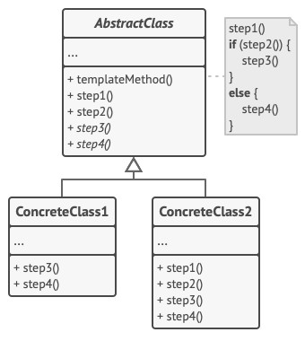

# Template method - Шаблонный метод
* Определяет основу (скелет) алгоритма и позволяет подклассам переопределять некоторые шаги алгоритма, не меняя его структуру.
* Другими словами: шаблонный метод - это каркас, в который наследники могут подставить реализации недостающих элементов.

### Аналогия из реального мира
Строительство типового дома.
* Есть архитектурный проект, в котором расписаны шаги строительства:
  * Заливка фундамента.
  * Постройка стен.
  * Перекрытие крыши.
  * Установка окон и т.д.
* Несмотря на стандартизацию каждого этапа, строители могут вносить небольшие изменения на каждом этапе, чтобы дом немного отличался от остальных.

### Решаемые проблемы
* Подклассы должны расширять базовый алгоритм, не меняя его структуры.
* Есть несколько классов, делающих практически одно и то же.  
При этом изменения в одном классе приводят к изменениям в других классах.
  * Можно перенести общее поведение в общий базовый класс, а отличающиеся шаги переопределить в наследниках.

### Решение
* Разбить алгоритм на последовательность шагов.
* Описать эти шаги в отдельных методах.
* Вызывать их в одном шаблонном методе друг за другом.
* У подклассов будет возможность изменить некоторые шаги алгоритма, не меняя его структуру и другие шаги.
* Для начала шаги можно сделать абстрактными, а затем перенести общее поведение в базовый класс.
* В итоге получится несколько типов шагов:
  1. Абстрактные шаги - подклассы должны их реализовать.
  2. Шаги с реализацией по умолчанию - подклассы могут их переопределять.
  3. Хуки (перехватчики) - дополнительные точки вклинивания в шаблонный метод.
    * Их необязательно переопределять.
    * В базовом абстрактном классе могут иметь пустую реализацию или реализацию по умолчанию.
    * Могут использоваться, например, для проверки условий перед выполнением определённого шага.

### Диаграмма классов

1. `AbstractClass`. Абстрактный класс определяет шаги алгоритма и содержит шаблонный метод, состоящий из вызовов этих шагов.  
Шаги могут быть как абстрактными, так и содержать реализацию по умолчанию.
2. `ConcreteClasses`. Конкретный класс переопределяет некоторые (или все) шаги алгоритма.  
Конкретные классы не переопределяют сам шаблонный метод.

### Недостатки
* Возможности по изменению кода ограничены скелетом алгоритма.
* С ростом количества шагов шаблонный метод становится слишком сложно поддерживать.
* Можно нарушить принцип подстановки Лисков (LSP), изменяя базовое поведение одного из шагов алгоритма через подкласс.

### Примеры использования
Когда есть определённая последовательность действий, у которой могут меняться лишь отдельные шаги.
* Импорт данных из файлов разных форматов.
  * Можно вынести в отдельные классы код, специфичный для форматов, а остальное оставить в базовом классе.
* Генерация документа по шаблону и отправка сформированного файла пользователю.
  * В подклассы выносится работа с различными шаблонами документов.
* Подключение к БД и выполнение запроса.
  * Подклассы реализуют подключение и выполнение запросов для конкретных СУБД.
* Фреймворки.
  * Шаблонный метод реализует инвариантные части архитектуры и предоставляет placeholders (заполнители) для вклинивания клиентского кода.

### Примеры в .NET
Любой абстрактный класс, который содержит защищённый абстрактный метод, является примером паттерна Шаблонный метод.
* В WCF:
  * Класс `CommunicationObject`: методы `Open`, `Close`, `Abort` и др. запечатаны (sealed), но при этом вызывают виртуальные или абстрактные методы `OnClosed`, `OnAbort` и др.
  * Классы `ChannelBase`, `ChannelFactoryBase`, `MessageHeader`, `ServiceHostBase`, `BodyWriter` - определяют каркас алгоритма и позволяют наследникам задавать лишь некоторые шаги.
* Другие примеры:
  * Класс `SafeHandle` и его наследники с абстрактным методом `ReleaseHandle`.
  * Класс `TaskScheduler` с внутренним (protected internal) абстрактным методом `QueueTask` и защищенным (protected) абстрактным методом `TryExecuteTaskInline`.
  * Класс `HashAlgorithm` с абстрактным методом `HashCore`.
  * Класс `DbCommandBuilder` с абстрактными методами `GetParameterName`, `GetParameterPlaceholder` и другими методами.

### Отношения с другими паттернами

#### Шаблонный метод VS Фабричный метод
Общее: Шаблонный метод и [Фабричный метод](../FactoryMethod/FactoryMethod.md) делегируют реализации поведения потомкам.

| Шаблонный метод                          | Фабричный метод                                 |
|------------------------------------------|-------------------------------------------------|
| Делегирует потомкам реализацию поведения | Делегирует потомкам реализацию создания объекта |
| Частично откладывает поведение           | Полностью откладывает создание объекта          |

Фабричный метод можно рассматривать как частный случай Шаблонного метода.  
Фабричный метод может быть частью большого класса с Шаблонными методами.

#### Шаблонный метод VS Стратегия
Общее: Шаблонный метод и [Стратегия](../Strategy/Strategy.md) позволяют кастомизировать алгоритм.

| Шаблонный метод                                                                | Стратегия                                                         |
|--------------------------------------------------------------------------------|-------------------------------------------------------------------|
| Сохраняет структуру алгоритма, позволяет подклассам переопределять только шаги | Позволяет изменить алгоритм полностью, подставив другую стратегию |
| Использует наследование                                                        | Использует композицию                                             |
| Работает на уровне классов                                                     | Работает на уровне объектов                                       |
