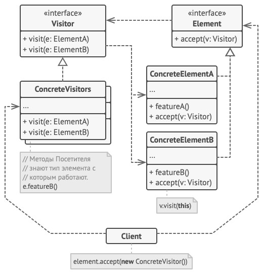

# Visitor - Посетитель
* Позволяет добавлять в программу новые операции, не изменяя классы объектов, над которыми эти операции могут выполняться.
* Другими словами: позволяет добавить новую операцию для целой иерархии классов, не изменяя код этих классов.

### Аналогия из реального мира
Работа страхового агента.  
Агент обходит различные дома, предлагая свои услуги.  
Для каждого из посещаемых типов домов у него есть особое предложение:
* Обычной семье он предлагает оформить медицинскую страховку.
* Банку он предлагает оформить страховку от грабежа.
* Фабрике от предлагает оформить страховку предприятия от пожара и наводнения.

### Решаемые проблемы
* Когда нужно выполнить какую-то операцию над всеми элементами сложной структуры объектов, н-р, над деревом.
  * Посетитель позволяет применять одну и ту же операцию к объектам различных классов.
* Когда над объектами сложной структуры объектов надо выполнять некоторые не связанные между собой операции и при этом нужно избежать засорения классов этими операциями.
  * Посетитель позволяет извлечь родственные операции из классов, составляющих структуру объектов, поместив их в один класс-посетитель.
  * Если структура объектов является общей для нескольких приложений, то паттерн позволит в каждое приложение включить только нужные операции.
* Когда новое поведение имеет смысл только для некоторых классов из существующей иерархии.
  * Посетитель позволяет определить поведение только для этих классов, оставив его пустым для всех остальных.

### Решение
* Новое поведение размещается в отдельном классе, вместо того чтобы множить его сразу в нескольких классах.
* Объекты, с которыми должно было быть связано поведение, не будут выполнять его самостоятельно.
  * Вместо этого эти объекты будут передаваться в методы посетителя.
* Код поведения, скорее всего, будет отличаться для объектов разных классов, поэтому и методов у посетителя может быть несколько.
* Определяются две иерархии классов:
  1. Для элементов, для которых надо определить новую операцию.
  2. Для посетителей, описывающих данную операцию.
* При необходимости посетитель может накапливать состояние при обходе структуры элементов.
* Как определять, какой метод посетителя вызвать?
  * Механизм перегрузки методов не подойдёт - каждый раз будет вызываться метод с наиболее общими параметрами.
  * Решение - использовать механизм двойной диспетчеризации (double dispatch).
    * Двойная диспетчеризация - когда выполнение операции зависит от имени запроса и двух типов получателей (объект `Visitor` и объект `Element`).
    * Вместо того, чтобы искать нужный метод, эта задача поручается объектам, которые передаются в параметрах посетителю.
    * А они уже вызывают правильный метод посетителя.
* В итоге исходные классы будут привязаны не к конкретному классу посетителей, а к их общему интерфейсу.
  * Поэтому при добавлении нового поведения будет достаточно создать новый класс посетителя и передать его в методы исходных классов.

### Диаграмма классов

1. `Visitor`. Посетитель описывает общий интерфейс для всех типов посетителей.  
Он объявляет набор методов, отличающихся типом входящего параметра, которые нужны для запуска операции для всех типов конкретных элементов.  
В языках, поддерживающих перегрузку методов, эти методы могут иметь одинаковые имена, но типы их параметров должны отличаться.
2. `ConcreteVisitor`. Конкретные посетители реализуют какое-то особенное поведение для всех типов элементов, которые можно подать через методы интерфейса посетителя.
3. `Element`. Элемент описывает метод принятия посетителя.  
Этот метод должен иметь единственный параметр, объявленный с типом интерфейса посетителя.
4. `ConcreteElement`. Конкретные элементы реализуют методы принятия посетителя.  
Цель этого метода - вызвать тот метод посещения, который соответствует типу этого элемента.  
Так посетитель узнает, с каким именно элементом он работает.
5. `Client`. Клиентом зачастую выступает коллекция или сложный составной объект, например, дерево [Компоновщика](../Composite/Composite.md).  
Зачастую клиент не привязан к конкретным классам элементов, работая с ними через общий интерфейс элементов.

### Недостатки
* Некоторые изменения, хоть и простые, но всё-таки придётся внести в классы.
* Паттерн не оправдан, если иерархия элементов часто меняется.
* Может привести к нарушению инкапсуляции элементов, когда посетителю потребуются приватные поля элементов.
  * Как вариант, можно сделать класс посетителя вложенным в класс элемента.
    * Вариант не подойдёт для языков программирования, не поддерживающих вложенные классы.

### Примеры использования
Посетитель выгодно применять, когда новые элементы добавляются редко, а новые операции - часто.
* Логирование, сериализация, экспорт объектов.
* Подсчёт общей стоимости и веса товаров в корзине.
* Подсчёт общей и средней зарплаты сотрудников разного уровня в разных отделах.

### Примеры в .NET
* `ExpressionVisitor` используется для работы с деревьями выражений (expression trees).  
Данный посетитель используется для навигации и преобразования деревьев выражений при реализации специализированных LINQ-провайдеров, а также для решения других задач.
* `Roslyn` содержит множество посетителей:
  * `CSharpSyntaxVisitor` предназначен для работы с синтаксическим деревом.
  * `SymbolVisitor<TResult>` - для работы с символами.
  * и др.
* `DbExpressionVisitor` используется Entity Framework для SQL-выражений.
